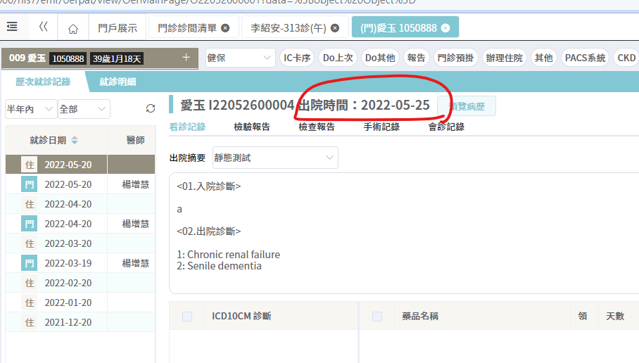

🔶做部分

🛑須等Demo Data

- [x] 🔶隱藏所有ICD9

- [x] 隱藏共用服務

- [x] 門診醫囑-報告-檢驗報告：切到該分頁 

- [x] 門診醫囑-主頁：隱藏檢查放射報告 

- [x] 歷次就診紀錄：診別查詢(應該不用動，只是沒資料)

  ​	debug: 修正refresh之後query條件被清空

- [x] 歷次就診紀錄：隱藏生命徵象、護理紀錄

- [ ] 🛑辦理住院：僅顯示該病患資料 

  【預約住院】

  - 注意事項：有稽核，不要新增兩次
  - Demo Data：住院號不重複
  - 就醫日期倒續 => 請後端做

- [x] 診斷書開立：隱藏預覽、計價

- [x] 門診醫囑-menu：上方(隱藏轉入回覆、轉出回覆、初診病歷、殘障手冊、連續處方箋紀錄)、下方(預覽病歷、電子轉診、雲端資料、過敏)

- [x] 重要病史：隱藏過敏記錄

- [x] 門診醫囑-存檔

- [x] amazon AI修復

- [x] 病患圖檔：隱藏沒功能的圖庫 

- [ ] 急診病患清單-查詢(包含留觀/大量病患/科別醫師篩選)

  - [ ] [【留觀/大量病患】](./oer_門急診醫囑/急診醫囑.md#待做功能)
  - [x] 【科別醫師篩選】
    - [x] 科別
    - [x] 照護醫師
    - [x] 住院醫師

- [x] 急診病患清單-隱藏DITTO、生命徵象
- [ ] 急診病患清單-轉科/醫師 隱藏
- [ ] 急診病患清單-醫師交班 隱藏
- [ ] 急診病患清單-無功能按鈕隱藏 
- [x] 急診醫囑-menu：隱藏照護選擇項目 
- [x] 急診醫囑-存檔
- [ ] 急診醫囑-歷程紀載：UI
- [ ] 急診醫囑-檢傷評估單： UI
- [x] 會診：左下醫師/個人隱藏
- [x] 入院病患管理：UX滾動軸修復 
- [ ] TPR：值班簽到 
- [ ] TPR：一篩選條件查詢
- [ ] 彙整病歷查詢維護：隱藏菜單 
- [x] 住院醫囑-標籤頁：隱藏病患個人資訊
- [ ] 一般處方：DC醫囑 
- [ ] 一般處方：異動醫囑
- [ ] 一般處方：隱藏AdmOrder按鈕 
- [ ] 一般處方：隱藏過敏記錄
- [ ] 預約住院處方：刪除/DC留一種 
- [ ] 診斷維護：歷史診斷 
- [ ] 診斷維護：複製住院中
- [ ] 診斷維護：DRG資訊兩頁改新版UI 
- [x] 診斷維護：[常]、[挑選診斷]外的按鈕隱藏
- [x] 診斷維護：隱藏DRG試算、意見回饋 
- [x] 病患問題管理：隱藏預覽 
- [x] 會診單回覆：隱藏團隊衛教 
- [x] 出院準備作業：隱藏預覽
- [x] 出院準備作業：隱藏DRG 
- [x] 健保卡資訊：隱藏
- [x] 手術紀錄單：隱藏 

確定要做的

- [x] 藥囑開立取消固定列
- [x] 隱藏健保科常用
- [x] 門診診間清單查詢
- [x] 診間病患清單分頁
- [ ] 預約住院：拿掉稽核欄位
- [ ] 預約住院：檢查醫令藥囑存檔
- [ ] 辦理住院：最底下footer toolbar UI重新調整
- [ ] 醫師/科套餐：修正SOP範本讀取
- [x] SOP：語音輸入 設定教學
- [ ] SOP範本：改只能修改單項 + 真實搜尋
- [x] 門診退掛：message box
- [x] 門診預約掛號：用最大字型、放大網頁比例重新調整search form的label-width
- [x] 門診預約掛號：沒有帶到外面的病患資訊
- [ ] 一般處方：檢查醫令藥囑存檔
- [ ] 一般處方：查詢條件
- [ ] 一般處方：用最大字型重新調整search form的label-width
- [ ] 一般處方：檢查反灰規則
- [x] 診間清單：隱藏 [兒童聯評清單]
- [x] 住院醫囑：一開始先隱藏TPR分頁
- [x] 診斷書：沒有帶到外面的病患資訊
- [x] 診斷書：科別帶入改這筆就醫的科別
- [x] 診斷書：共0筆
- [x] 診斷書：醫師DD、科別DD
- [ ] 診斷維護：ICD10(住院中)診斷類別DD 
- [ ] 病患問題管理：存檔bug修復 
- [x] Do上次
- [ ] SOP套餐：會帶出undefined或null

靜態假資料

(等其他資料建完)

- [ ] 門診預掛靜態demo data
- [ ] ♦️預約住院處方：demo data
- [ ] 病歷首頁維護：出院病摘demo data
- [ ] 急診醫囑-歷程紀載：demo data 
- [ ] 急診醫囑-檢傷評估單： demo data

自己遇到的問題

- [x] 急診病患清單：加popupLov輸入框enter觸發查詢
- [x] 急診病患清單：醫師直接打代碼查詢
- [x] 急診病患清單：encounterNo直接進入急診醫囑的部分改成跟門診一樣(encounterNo沒有值就不查)
- [x] 門診診間清單：調整欄寬
- [ ] 門診診間清單：凸顯今日
- [x] 診間病患清單：病患查詢
- [x] 診間病患清單：人數init清零
- [x] 歷次就診紀錄：debug-診別查詢下拉切換怪怪的
- [x] 歷次就診紀錄：科別/醫師查詢
- [ ] 住院病患清單查詢：改popup或結合lov
- [x] 診斷書：form欄位調整

有空再改

- [ ] 歷次就醫紀錄標題 出院時間改小

  