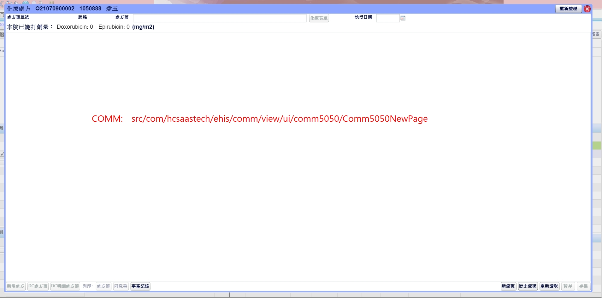
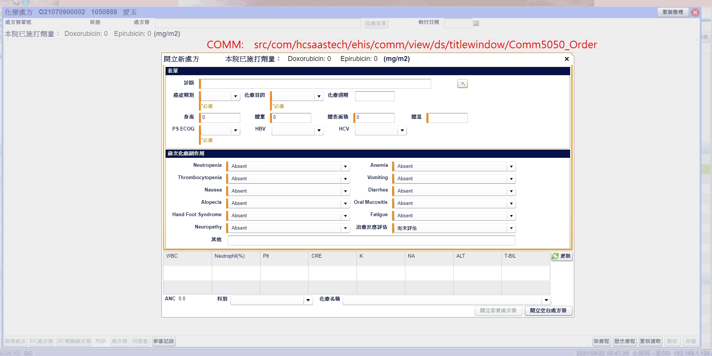
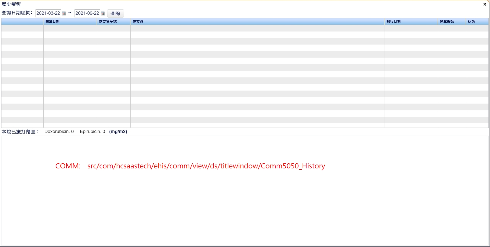
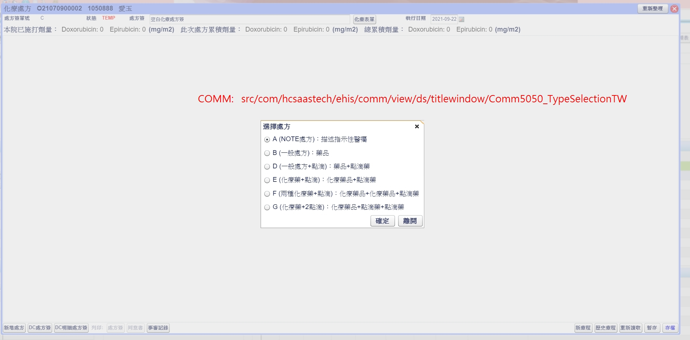
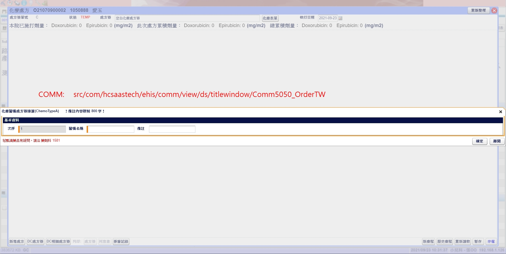

# 化療處方/comm5050newpage





```js
var dropDowns:Array =
[
  [ComCodedtlDropDown, "NeutropeniaCode", false, "codeType='NeutropeniaCode'", false],
  [ComCodedtlDropDown, "AnemiaCode", false, "codeType='AnemiaCode'", false],
  [ComCodedtlDropDown, "ThrombocytopeniaCode", false, "codeType='ThrombocytopeniaCode'", false],
  [ComCodedtlDropDown, "VomitingCode", false, "codeType='VomitingCode'", false],
  [ComCodedtlDropDown, "NauseaCode", false, "codeType='NauseaCode'", false],
  [ComCodedtlDropDown, "DiarrheaCode", false, "codeType='DiarrheaCode'", false],
  [ComCodedtlDropDown, "OralMucositisCode", false, "codeType='OralMucositisCode'", false],
  [ComCodedtlDropDown, "AlopeciaCode", false, "codeType='AlopeciaCode'", false],
  [ComCodedtlDropDown, "HandFootSyndromeCode", false, "codeType='HandFootSyndromeCode'", false],
  [ComCodedtlDropDown, "FatigueCode", false, "codeType='FatigueCode'", false],
  [ComCodedtlDropDown, "NeuropathyCode", false, "codeType='NeuropathyCode'", false],
  [ComCodedtlDropDown, "TreatRespAassess", false, "codeType='TreatRespAassess'", false]
];
```









