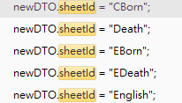

# 查詢條件

- **documentSystemScid**：

  OER

- **reportTypeScid**：

  diagnosis

- **reportSubtypeScid**：

  General/CBorn/Death/EBorn/EDeath/English

- **sheetId**：

  General/CBorn/Death/EBorn/EDeath/English



# 中英對照

```
{
  label: "一般診斷書",
  name: "General"
},
{
  label: "中文出生證明書",
  name: "CBorn"
},
{
  label: "死亡證明書",
  name: "Death"
},
{
  label: "英文診斷書",
  name: "English"
},
{
  label: "英文出生證明書",
  name: "EBorn"
},
{
  label: "英文死亡證明書",
  name: "EDeath"
},
```

## 欄位

## 中文出生證明書 CBorn

```xml
<node>
  <node fieldId="CBproveChartNo" label="嬰兒病歷號" value="0000000"/>
  <node fieldId="CBproveName" label="姓名" value="測試病患"/>
  <node fieldId="CBprovePlaceOpt" label="" value=""/>
  <node fieldId="CBproveMName" label="姓名" value="null"/>
  <node fieldId="CBproveIdNo" label="身份證號" value="A100000001"/>
  <node fieldId="CBproveMBirth" label="生日" value=""/>
  <node fieldId="CBproveMPlace" label="戶籍地" value="峯"/>
  <node fieldId="CBproveMIdNo" label="身份證號" value="null"/>
  <node fieldId="CBproveMChartNo" label="母親病歷號" value=""/>
  <node fieldId="CBproveAreaCode" label="區碼" value=""/>
  <node fieldId="CBproveMPassport" label="護照號碼" value=""/>
  <node fieldId="CBproveMMobi" label="手機" value=""/>
  <node fieldId="CBproveNowAddrOpt" label="" value=""/>
  <node fieldId="CBproveNowAddr" label="現住地址" value="台中市北屯區遼陽一街27號"/>
  <node fieldId="CBproveOTel" label="連絡電話(公)" value=""/>
  <node fieldId="CBproveHTel" label="連絡電話(宅)" value="2729-7568"/>
  <node fieldId="CBproveFName" label="姓名" value="null"/>
  <node fieldId="CBproveFBirth" label="生日" value=""/>
  <node fieldId="CBproveFIdNo" label="身份證號" value="null"/>
  <node fieldId="CBproveFPlace" label="戶籍地址" value=""/>
  <node fieldId="CBproveFPassport" label="護照號碼" value=""/>
  <node fieldId="CBproveFMobi" label="手機" value=""/>
  <node fieldId="CBproveTotAliveBaby" label="" value=""/>
  <node fieldId="CBproveSexType" label="性別" value="null"/>
  <node fieldId="CBproveBornCycle" label="懷孕週數" value=""/>
  <node fieldId="CBproveBornWeight" label="出生體重(GM)" value=""/>
  <node fieldId="CBproveBornHight" label="出生身高(cm)" value=""/>
  <node fieldId="CBproveBirthDate" label="出生日期" value=""/>
  <node fieldId="CBproveBornTime" label="出生時間" value=""/>
  <node fieldId="CBproveBornType" label="胎別" value="null"/>
  <node fieldId="CBproveBornTypeNo" label=">參胎數" value=""/>
  <node fieldId="CBproveBornBoys" label="男數" value=""/>
  <node fieldId="CBproveBornGirls" label="女數" value=""/>
  <node fieldId="CBproveBornUnknowns" label="未明數" value=""/>
  <node fieldId="CBproveBornPlace" label="出生場所" value="null"/>
  <node fieldId="CBproveBornProvice" label="縣市" value=""/>
  <node fieldId="CBproveBornCountry" label="出生地" value=""/>
  <node fieldId="CBproveBornByWhom" label="接生者" value="null"/>
  <node fieldId="CBproveDocCode" label="醫師代碼" value=""/>
  <node fieldId="CBproveDocId" label="醫師證書字號" value=""/>
  <node fieldId="CBproveBornMethod" label="生產方式" value=""/>
  <node fieldId="CBproveApgarFirst" label="Apgar Score第一分鐘" value="null"/>
  <node fieldId="CBproveApgarFifth" label="Apgar Score第五分鐘" value="null"/>
  <node fieldId="CBproveAliveReason" label="活產轉歸" value=""/>
  <node fieldId="CBproveDeaderDays" label="死亡者存活期:天" value=""/>
  <node fieldId="CBproveDeaderHours" label="小時" value=""/>
  <node fieldId="CBproveTranserDays" label="轉院者年齡:天" value=""/>
  <node fieldId="CBproveTranserHours" label="小時" value=""/>
  <node fieldId="CBproveSplCode1" label="特殊情形代碼" value=""/>
  <node fieldId="CBproveSplCode2" label="" value=""/>
  <node fieldId="CBproveSplCode3" label="" value=""/>
  <node fieldId="CBproveSplDesc" label="其它" value=""/>
  <node fieldId="CBproveTreatCode1" label="特殊處理代碼" value=""/>
  <node fieldId="CBproveTreatCode2" label="" value=""/>
  <node fieldId="CBproveTreatCode3" label="" value=""/>
  <node fieldId="CBproveTreatDesc" label="其它" value=""/>
  <node fieldId="CBproveCauseCode1" label="併發症代碼" value=""/>
  <node fieldId="CBproveCauseCode2" label="" value=""/>
  <node fieldId="CBproveCauseCode3" label="" value=""/>
  <node fieldId="CBproveCauseDesc" label="其它" value=""/>
  <node fieldId="CBproveFaultCode1" label="缺陷代碼" value=""/>
  <node fieldId="CBproveFaultCode2" label="" value=""/>
  <node fieldId="CBproveFaultCode3" label="" value=""/>
  <node fieldId="CBproveFaultDesc" label="其它" value=""/>
  <node fieldId="CBproveBornOrder" label="同胎次序" value=""/>
  <node fieldId="CBproveFeedDate" label="哺乳開始日期" value=""/>
  <node fieldId="CBproveFBloodDate" label="採血日期" value=""/>
  <node fieldId="CBproveEarlyFlag" label="早產否" value="N"/>
  <node fieldId="CBproveTransbloodFlag" label="輸血否" value="N"/>
  <node fieldId="CBproveFSendDate" label="檢體送出日期" value=""/>
  <node fieldId="CBproveFResultDate" label="篩檢結果日期" value=""/>
  <node fieldId="CBproveFResult" label="結果報告" value=""/>
  <node fieldId="CBproveSBloodDate" label="採血日期" value=""/>
  <node fieldId="CBproveSSendDate" label="檢體送出日期" value=""/>
  <node fieldId="CBproveSResultDate" label="篩檢結果日期" value=""/>
  <node fieldId="CBproveSResult" label="結果報告" value=""/>
  <node fieldId="CBproveBedNo" label="床號" value=""/>
  <node fieldId="CBproveMemo" label="備註" value=""/>
  <node fieldId="CBproveBornFlag" label="本院出生否" value="N"/>
  <node fieldId="CBproveInsCardNo" label="健卡號" value=""/>
  <node fieldId="CBproveBreastFlag" label="母奶" value="N"/>
  <node fieldId="CBproveMilkName" label="MILK" value=""/>
  <node fieldId="CBproveFnowAddrOpt" label="現住地址" value=""/>
  <node fieldId="CBproveTranHospital" label="轉院醫院名稱" value=""/>
  <node fieldId="HospitalName" label="醫院名稱" value="財團法人羅許基金會羅東博愛醫院" visible="false"/>
  <node fieldId="HospitalLicenseId" label="醫院開業執照字號" value="1434020015" visible="false"/>
  <node fieldId="HospitalAddress" label="醫院住址" value="宜蘭縣羅東鎮南昌里南昌街81、83號" visible="false"/>
  <node fieldId="CBproveApplyDate" label="申請列印日期" value="2012-08-21" visible="false"/>
</node>
```

```json
```

## 死亡證明書 Death

```xml
<node>
  <node fieldId="DproveDproveSeq" label="死亡證字號" value="1612049254"/>
  <node fieldId="DproveChartNo" label="病歷號" value="0000000"/>
  <node fieldId="DprovebirthApm" label="出生時段" value=""/>
  <node fieldId="DprovebirthTime" label="出生時間(HH:MM)" value=""/>
  <node fieldId="DprovedeadDate" label="死亡日期" value="2016-12-26"/>
  <node fieldId="DprovedeadApm" label="死亡時段" value="PM" description="PM"/>
  <node fieldId="DprovedeadTime" label="死亡時間(HH:MM)" value="20:11"/>
  <node fieldId="DprovedeadPlace" label="死亡地點" value="宜蘭縣羅東鎮南昌里南昌街81、83號"/>
  <node fieldId="DprovedeadPlaceType" label="死亡地點類別(1..5)" value="1" description="醫院"/>
  <node fieldId="DprovedeadType" label="死亡方式(1..5)" value="1" description="自然死(純粹因疾病或自然老化所引起之死亡)"/>
  <node fieldId="DprovemarryStatus" label="婚姻狀況" value="1" description="未婚"/>
  <node fieldId="DprovepregnantStatus" label="懷孕情形(如死亡是女性)" value=""/>
  <node fieldId="Dprovereason1" label="1.直接引起死亡之痴病或傷害:" value="hjsdhjaskd"/>
  <node fieldId="Dprovereason2" label="乙.先行原因" value=""/>
  <node fieldId="Dprovereason3" label="丙.先行原因" value=""/>
  <node fieldId="Dprovereason4" label="2.其他對於死亡有影響之疾病或身體狀況:" value=""/>
  <node fieldId="Dprovereason5" label="2.其他對於死亡有影響之疾病或身體狀況:" value=""/>
  <node fieldId="Dprovetime1" label="甲.發病至死亡時間" value=""/>
  <node fieldId="Dprovetime2" label="乙.發病至死亡時間" value=""/>
  <node fieldId="Dprovetime3" label="丙.發病至死亡時間" value=""/>
  <node fieldId="DprovedocName" label="開立醫師" value="" description=""/>
  <node fieldId="DprovedocId" label="醫師證書字號" value="17349"/>
  <node fieldId="PatName" label="病患姓名" value="測試病患" visible="false"/>
  <node fieldId="PatSexType" label="病患性別(1/0)" value="F" visible="false"/>
  <node fieldId="PatIdType" label="證號類別" value="5" visible="false"/>
  <node fieldId="PatIdNo" label="病患身分證號" value="A123456789" visible="false"/>
  <node fieldId="PatBirthdayType " label="病患出生民國前後(+,-)" value="" visible="false"/>
  <node fieldId="PatBirthday" label="病患出生年月日(yyyy-mm-dd)" value="1921-10-10" visible="false"/>
  <node fieldId="PatAddrName" label="病患戶籍地址" value="臺中市北屯區遼陽一街27號" visible="false"/>
  <node fieldId="HospitalName" label="醫療院所名稱" value="醫療財團法人羅許基金會羅東博愛醫院" visible="false"/>
  <node fieldId="HospitalLicense" label="醫療院所開業執照字" value="宜府醫院字第001號" visible="false"/>
  <node fieldId="HospitalIdNo" label="醫療院所代號" value="1134020019" visible="false"/>
  <node fieldId="HospitalAddress" label="醫療院所地址" value="宜蘭縣羅東鎮南昌里南昌街81、83號" visible="false"/>
  <node fieldId="DproveApplyDate" label="列印日期(yyyy-mm-dd)" value="2016-12-26" visible="false"/>
</node>
```

## 一般診斷書 General

```xml
<node>
  <node fieldId="GlproveGlproveSeq" label="診斷書序號" value="1112002498"/>
  <node fieldId="GlproveKindCode" label="類別" value="3" description="丙種診斷書"/>
  <node fieldId="GlproveChartNo" label="病歷號" value="0763028"/>
  <node fieldId="GlprovePatSrc" label="病患來源" value="O" description="門診"/>
  <node fieldId="GlproveApplyDate" label="開立列印日期" value="2011-12-30"/>
  <node fieldId="GlproveDeptCode" label="科別" value="10" description="內科"/>
  <node fieldId="GlproveDocCode" label="醫師" value="1003" description="林正文"/>
  <node fieldId="GlproveDiag1" label="病　名1." value="眩暈"/>
  <node fieldId="GlproveDiag2" label="病　名2." value="測試 2"/>
  <node fieldId="GlproveDiag3" label="病　名3." value="測試 3"/>
  <node fieldId="GlproveDiag4" label="病　名4." value="測試 4"/>
  <node fieldId="GlproveDiag5" label="病　名5." value="測試 5"/>
  <node fieldId="GlproveDiag6" label="病　名6." value="測試 6"/>
  <node fieldId="GlproveDiag7" label="病　名7." value="測試 7"/>
  <node fieldId="GlproveDiag8" label="病　名8." value="測試 8"/>
  <node fieldId="GlproveDiag9" label="病　名9." value="測試 9"/>
  <node fieldId="GlproveDiag10" label="病 名10." value="測試 10"/>
  <node fieldId="GlproveTreatDesc1" label="醫師囑言" value="這僅是資管部測試的測試, this is a test
line:2
line:3"/>
  <node fieldId="PatIdNo" label="身分證號" value="T000000915" visible="false"/>
  <node fieldId="PatName" label="姓名" value="資管部測試" visible="false"/>
  <node fieldId="PatSexType" label="性別" value="F" visible="false"/>
  <node fieldId="PatProfessional" label="職業" value="" visible="false"/>
  <node fieldId="PatAge" label="年齡" value="0720801" visible="false"/>
  <node fieldId="PatBirthday" label="出生年月日(yyyy-mm-dd)" value="1961-09-16" visible="false"/>
  <node fieldId="PatEncounterDate" label="門診應診日期" value="2011-12-26"/>
  <node fieldId="PatEncounterStDate" label="住院應診日期起日" value=""/>
  <node fieldId="PatEncounterEdDate" label="住院應診日期迄日" value=""/>
  <node fieldId="PatEncounterDays" label="住院日數" value="" visible="false"/>
  <node fieldId="DocLicenseId" label="診治醫師證字號" value="" visible="false"/>
  <node fieldId="IpdBedNo" label="住院床號" value="" visible="false"/>
  <node fieldId="HospitalName" label="院所名稱" value="財團法人羅許基金會羅東博愛醫院" visible="false"/>
  <node fieldId="HospitalOwnerDoc" label="院所負責醫師" value="" visible="false"/>
  <node fieldId="PatAddress" label="住址" value="宜蘭縣羅東鎮南昌路83號" visible="false"/>
</node>

```

## 英文出生證明書 EBorn

```xml
<node>
  <node fieldId="EBproveEBproveSeq" label="出生證明書編號" value="1801025977"/>
  <node fieldId="EBproveChartNo" label="病歷號" value="test"/>
  <node fieldId="EBproveChdName" label="姓名" value=""/>
  <node fieldId="EBproveChdSex" label="性別" value=""/>
  <node fieldId="EBproveChdBirth" label="出生日期" value=""/>
  <node fieldId="EBproveChdBirthTime" label="出生時間" value=""/>
  <node fieldId="EBproveChdBirthType" label="產別" value=""/>
  <node fieldId="EBproveFatName" label="姓名" value=""/>
  <node fieldId="EBproveFatBirth" label="生日" value=""/>
  <node fieldId="EBproveFatIdNo" label="身份證號" value=""/>
  <node fieldId="EBproveMotName" label="姓名" value=""/>
  <node fieldId="EBproveMotBirth" label="生日" value=""/>
  <node fieldId="EBproveMothIdNo" label="身份證號" value=""/>
  <node fieldId="EBproveMotCounFlag" label="" value=""/>
  <node fieldId="EBproveMotCountry" label="現居國家" value=""/>
  <node fieldId="EBproveOpDoc" label="接生醫師" value=""/>
  <node fieldId="EBproveIssueDate" label="開證明單日期" value="2018-01-12"/>
  <node fieldId="EBproveFPassport" label="國藉及護照號碼" value=""/>
  <node fieldId="EBproveMPassport" label="國藉及護照號碼" value=""/>
  <node fieldId="EbproveSuperintendent" label="院長" value="" visible="false"/>
  <node fieldId="EbprovePlaceOfBirth" label="出生地" value="" visible="false"/>
</node>

```

## 英文診斷書 English

```xml
<node>
  <node fieldId="EproveEproveSeq" label="診斷書序號" value="1708007262"/>
  <node fieldId="EproveName" label="Name" value="資管部測試"/>
  <node fieldId="EproveEnglishName" label="English Name" value="dsaf"/>
  <node fieldId="EproveSex" label="Sex" value="F" description="Female"/>
  <node fieldId="EproveBirthDate" label="Date of birth" value="1961-09-16"/>
  <node fieldId="EproveAdmissionDate" label="Admission Date" value=""/>
  <node fieldId="EproveChartNo" label="Chart No" value="0763028"/>
  <node fieldId="EproveOccupation" label="Occupation" value="abc"/>
  <node fieldId="EproveAddress" label="Address" value="dsfaededf"/>
  <node fieldId="EproveDiagnosis" label="Diagnosis" value="test"/>
  <node fieldId="EproveAdvice" label="Doctor’s advice" value="22222"/>
  <node fieldId="EprovePhysician" label="Attending Physician" value="R999" description="仁愛轉檢"/>
  <node fieldId="EproveDateissue" label="Date issued" value="2017-08-04"/>
</node>
```

## 英文死亡證明書 EDeath

```xml
<node>
  <node fieldId="DproveDproveSeq" label="No." value=""/>
  <node fieldId="DproveChartNo" label="Registration No" value="0763028"/>
  <node fieldId="DprovePatName" label="DECEDENT's NAFE" value="test"/>
  <node fieldId="DprovePatAddress" label="REGISTERED PERFANET RESIDENCE" value="test"/>
  <node fieldId="DprovebirthTime" label="TIFE OF BIRTH(HH:FF)" value=""/>
  <node fieldId="DprovedeadDate" label="DATE OF DEATH" value="2016-03-08"/>
  <node fieldId="DprovedeadTime" label="TIFE OF DEATH (HH:FF)" value="22:54"/>
  <node fieldId="DprovedeadPlace" label="location of death(street and number, city, town, country)" value="No.81、83, Nanchang St.,；No.61、63, Zhanqian S. Rd., Luodong Township, Yilan County 265, Taiwan (R.O.C.)"/>
  <node fieldId="DprovedeadPlaceType" label="PLACE OF DEATH" value="1" description="Hospital"/>
  <node fieldId="DprovedeadType" label="FANNER OF DEATH" value="3" description="Suicide"/>
  <node fieldId="DprovepregnantStatus" label="IF FEFALE" value=""/>
  <node fieldId="Dprovereason10" label="A." value="tes"/>
  <node fieldId="Dprovereason11" label="Approximate interval: Onset to death" value="es"/>
  <node fieldId="Dprovereason20" label="B." value=""/>
  <node fieldId="Dprovereason21" label="Approximate interval: Onset to death" value=""/>
  <node fieldId="Dprovereason30" label="C." value=""/>
  <node fieldId="Dprovereason31" label="Approximate interval: Onset to death" value=""/>
  <node fieldId="Dprovereason40" label="D." value=""/>
  <node fieldId="Dprovereason41" label="Approximate interval: Onset to death" value=""/>
  <node fieldId="Dprovereason99" label="Other significant conditions contributing to death but not resulting in the underlying cause given in Part I:" value=""/>
  <node fieldId="DprovedocName" label="Name of Certifying Physician" value="1A17" description="張賢政"/>
  <node fieldId="DprovedocId" label="License Number of Certifying Physician" value="034625"/>
  <node fieldId="PatName" label="病患姓名" value="資管部測試" visible="false"/>
  <node fieldId="PatSexType" label="病患性別(1/0)" value="F" visible="false"/>
  <node fieldId="PatIdType" label="證號類別" value="5" visible="false"/>
  <node fieldId="PatIdNo" label="病患身分證號" value="T000000915" visible="false"/>
  <node fieldId="PatBirthday" label="病患出生年月日(yyyy-mm-dd)" value="1961-09-16" visible="false"/>
  <node fieldId="PatAddrName" label="病患戶籍地址" value="宜蘭縣羅東鎮南昌路83號" visible="false"/>
  <node fieldId="HospitalName" label="醫療院所名稱" value="Lo-Hsu Fedical Foundation, Lotung Poh-Ai Hospital" visible="false"/>
  <node fieldId="HospitalLicense" label="醫療院所開業執照字" value="宜府醫院字第001號" visible="false"/>
  <node fieldId="HospitalIdNo" label="醫療院所代號" value="1134020019" visible="false"/>
  <node fieldId="HospitalAddress" label="醫療院所地址" value="No.81、83, Nanchang St.,；No.61、63, Zhanqian S. Rd., Luodong Township, Yilan County 265, Taiwan (R.O.C.)" visible="false"/>
  <node fieldId="DproveApplyDate" label="列印日期(yyyy-mm-dd)" value="2016-03-15" visible="false"/>
</node>
```

