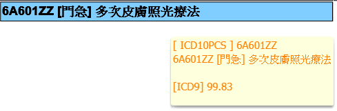
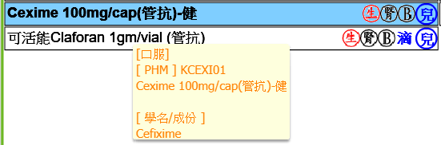
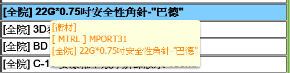

# 1.醫囑選單 emrxmlstructure

[動態OrderMenu.md](動態OrderMenu.md)


```scss
// 用途類別
xmlTypeNcid：
 -DOC_ORDER_FREQUENT- //醫師常用
 -DOC_ORDER_PKG- //醫師套餐
 -DEPT_ORDER_FREQUENT- //科常用
 -DEPT_ORDER_PKG- //科套餐

 -HOST_ORDER_FREQUENT- //全院常用(Note)
 -DRG_ORDER_PKG- //DRG套餐
 -DRG40_ORDER_PKG- //DRG套餐
 -OTH_ORDER_FREQUENT- //16樓檢查中心、基因檢測
 -ORDER_XML- //OR XML
 -DOC_TEACH_FREQUENT- //醫師常用(衛教)
 -DEPT_TEACH_FREQUENT- //科常用(衛教)
```


**問題**

- 使用分類 (fillerSysNcid) 是什麼？ 

  ==查詢的結果是ORDER_MENU是M、常用項和套餐是T==

  ==但還是不清楚確切的意思==


## 常用項

> XML_TYPE_NCID: `DOC_ORDER_FREQUENT` | `DOC_ORDER_PKG`
>
> XML_SUB_TYPE_NCID: `ICD10` | `PHM` | `TREDEN` | `EXAM` | `ORAN` | `MTRL` | `OTH` | `NOTE` 
>
> FILLER_SYS_NCID: `T`


原xml格式

```xml
<tree id="MTRL" label="科常用(衛材)" isBranch="true">
  <node id="N1415169881052_17" usageOei="A" isBranch="true" label="Insulin "/>
  <node id="N1282092188828_17" label="常用衛材" isBranch="true">
    <node id="N1462195351332_17" usageOei="A" isBranch="true" label="CPR"/>
  </node>
</tree>
```


舊his的**XML_CONTENT**欄位存的是xml格式，新的資料用json存，以下為資料結構：

> **nodeId格式**
>
> - 根目錄： "-1"
>
> - 子目錄：`"OEN" + 現在時間的X格式 + "_" + ownerCode`

```json
{
  "label":"個人常用(ICD10)",
  "xmlSubTypeNcid":"ICD10",
  "nodeId":"-1",
  "children":[
    {
      "label":"外傷",
      "nodeId":"OEN1629443692840_test30000",
      "usageOei":"A",
      "children":[
        {
          "label":"1",
          "nodeId":"OEN1629443789649_test30000",
          "children":[]
        },
        {
          "label":"2",
          "nodeId":"OEN1630659898139_test30000",
          "children":[]
        },
        {
          "label":"3",
          "nodeId":"OEN1631328882558_test30000",
          "children":[]
        }
      ]
    }
  ]
}
```


**欄位**

```sql
XML_TYPE_NCID      VARCHAR2(20 char), '用途類別'(醫師/科別--常用/套餐)
OWNER_NCID         VARCHAR2(20 char), '使用單元別'(醫師/科別代碼...)
XML_SUB_TYPE_NCID  VARCHAR2(20 char), '次用途類別'(ICD10、PKG、EXAM、NOTE...)
FILLER_SYS_NCID    VARCHAR2(20 char), '使用分類'
DISPLAY_SEQ        NUMBER(9),  '順序'
XML_NAME           VARCHAR2(200 char), 'XML名稱'(比如：個人常用(ICD10)...)
XML_CONTENT        CLOB, 'XML結構內容'-->'json格式'
```

```json
displaySeq: 0
fillerSysNcid: "T" //使用分類(?)
id: "d774d541d6c14c6287c12b08e4a52458"
ownerNcid: "0092" //醫師/科別代碼
version: 17
xmlContent: "" //json格式的目錄結構內容
xmlName: "個人常用(ICD10)" //根目錄名稱
xmlSubTypeNcid: "ICD10" //次用途類別(ICD10、PKG、EXAM、NOTE...)
xmlTypeNcid: "DOC_ORDER_FREQUENT" //用途類別(醫師/科別--常用/套餐)
```


**步驟**

[ 1 ] 進入頁面先查ICD10的目錄

[ 2 ] 新的目錄：如果用 ownerNcid + xmlSubTypeNcid 查不到資料，代表要新增根目錄？

​		  <span style="padding:6px;"><font style="font-weight:800;">從外部取得：</font>   <font style="border:gray 1px solid;padding:1px 6px;border-radius:5px;">用途類別 xmlTypeNcid (醫師/科別--常用/套餐)</font> + <font style="border:gray 1px solid;padding:1px 6px;border-radius:5px;">使用單元別 ownerNcid (醫師/科別代碼)</font></span>

​	=>  <span style="padding:6px;"><font style="font-weight:800;">從下拉取得：</font>   <font style="border:gray 1px solid;padding:1px 6px;border-radius:5px;">次用途類別 xmlSubTypeNcid (ICD10、PKG、EXAM、NOTE...)</font></span>

​	=>  <font style="padding:1px 6px;border-radius:5px;border:gray 1px solid;">產生頂級目錄名稱 xmlName</font> EX: ` ‵個人常用(${對應的次用途類別名})‵ ` + <font style="padding:1px 6px;border-radius:5px;border:gray 1px solid;">使用分類 fillerSysNcid</font>

​	=>  存進 dataMenu 

​	=>  放進 datatreeList：`this.datatreeList.push(this.dataMenu)`

​	=>  如果切換下拉選項，先post再換根目錄

[ 3 ] 切換下拉選項

​	先從 datatreeList 裡找有沒有資料的 xmlSubTypeNcid 和下拉的綁定值(type) 相同，有的話就把datatree裡的資料換成該筆資料；

​	沒有就新增一筆到 datatreeList 同時存進資料庫 ，並把 datatree 裡的資料換成新增的資料。


## 套餐

> XML_TYPE_NCID: `DOC_ORDER_PKG` | `DEPT_ORDER_PKG`
>
> XML_SUB_TYPE_NCID: `PKG`
>
> FILLER_SYS_NCID: `T`
>
> XML_NAME: `醫師套餐` | `科套餐`

HIS3 原xml格式

醫師

```xml
<tree id="PKG" label="醫師套餐" isBranch="true">
  <node id="N1281664660296_11" label="門急診" isBranch="true">
    <item id="P1498460275129_11" label="新增套餐"/>
  </node>
  <node id="N1281664660296_11" label="住院" isBranch="true">
    <item id="P1281664660328_11" label="Admission Herpes zoster"/>
    <item id="P1281664660609_11" label="Admission psorisis vulgaris"/>
    <item id="P1281664660859_11" label="Cellulitis"/>
    <item id="P1281664661046_11" label="Fixed drug eruption"/>
    <item id="P1281664661296_11" label="Acute urticaria "/>
    <item id="P1281664661531_11" label="OTHER DZ"/>
  </node>
  <item id="P1498699572954_11" label="新增套餐"/>
</tree>
```

科

```xml
<tree id="PKG" label="科套餐" isBranch="true">
  <node id="N1346982139156_15" usageOei="A" isBranch="true" label="專案套餐">
    <item id="P1346982141062_15" label="心血管代謝症候群套餐" usageOei="A" hotKey=""/>
  </node>
  <node id="N1378691337241_15" usageOei="A" isBranch="true" label="急救項目"/>
  <node id="N1516347180358_15" usageOei="A" isBranch="true" label="血腫科">
    <item id="P1516347211041_15" usageOei="A" hotKey="" label="admission order" deliverToLoc="" searchKey=""/>
  </node>
  <item id="P1321319026093_15" label="CPR" usageOei="A" hotKey=""/>
</tree>
```

HIS7 json

```json
{
  "label":"科套餐",
  "isBranch":true,
  "nodeId":"-1",
  "children":[
    {
      "label":"資料夾名稱",
      "isBranch":true,
      "nodeId":"N1516347180358_15", //N${time}_${OWNER_NCID}
      "usageOei":"A",
      "children":[
        {
          "label":"套餐名稱",
          "isBranch":false,
          "nodeId":"P1321319026093_15", //P${time}_${OWNER_NCID}
          "usageOei":"A",
          "hotKey":"", //快速鍵
          "deliverToLoc":"", //開立地點
          "searchKey":"" //快速關鍵字
        }
      ]
    }
  ]
}
```


# 2. 個人/科常用項 emrfrequent

> DD：
>
> 適用開立部門：codeType = 'entrySystem'
>
> 醫囑分類：codeType = 'OrderType'

```sql
create table EMR_FREQUENT
(
  /* 上半部 */
  SEQ_NO             NUMBER(5),  '排序'
  ORDER_TYPE         VARCHAR2(20 char), '分類'(DD:comorderType1)
  ORDER_CODE         VARCHAR2(50 char), '項目代碼'
  DISPLAY_NAME       VARCHAR2(4000 char), '項目名稱'
  DISCHG_FLAG        VARCHAR2(1),'領'(YN)
  USAGE_OEI          VARCHAR2(20 char), '限制'(DD:comentrySystem)
  QTY                NUMBER(10, 3), '數量'(maxValue="99999.999" minValue="0.000")
  SELF_FLAG          VARCHAR2(1 char), '自費否'
  DOSAGE_UNIT        VARCHAR2(20 char), '單位'
  CIR_CODE           VARCHAR2(20 char), '頻率'
  PATH_CODE          VARCHAR2(20 char), '途徑'
  DAYS               NUMBER(3), '天數'
  SPECIMEN_CODE      VARCHAR2(20 char), '檢體'(ComOrderspecimentdtlLov)
  REMARK             VARCHAR2(1000 char), '備註'
  TQTY               NUMBER(19, 2), '總量'
  
  /* 下半部 */
  ORDER_SYS          VARCHAR2(20 char), '醫囑類別'
  OWNER_CODE         VARCHAR2(20 char), '醫師/科別'
  NODE_ID            VARCHAR2(40 char), '目錄ID'
 
  ----------------------------------------------------------------
  ID               VARCHAR2(50),
  VERSION            NUMBER(19),
  F_CREATORUSERID    VARCHAR2(50),
  F_CREATORTIME      DATE,
  F_LASTMODIFYTIME   DATE,
  F_LASTMODIFYUSERID VARCHAR2(50),
)
```

```json
cirCode: "ST" // 頻率
days: 1
dischgFlag: "N" // 領
displayName: "菌血症"
dosageUnit: null // 單位
id: "882975"
index: 0
nodeId: "N1412041632727_1622" // = 子目錄nodeId
orderCode: "R78.81" // '醫師/科別'
orderSys: "ICD10"  // = emrxmlstructure/xmlSubTypeNcid   // '醫囑類別'
orderType: "ICD10CM"
ownerCode: "1622"
pathCode: null // 途徑
qty: 1 // 數量
remark: ",,,菌血症"
rowStatus: null
selfFlag: "N"
seqNo: 0 // 排序
specimenCode: null // 檢體
usageOei: "A"
version: 3
```


查： nodeId

存： 上半部從 com 帶進來，下半部從 emrxmlstructure 帶


## ICD10CM


<div style="width:450px; height:80px;border: rgb(255,255,148) 1px solid; color: rgb(255,190,100); padding:5px; background: rgba(0,0,0,.5)">
  [ICD10CM] icd10code (urgFlag)(slowFlag)(rareFlag)(infFlag)<br>
  icd10code [不確定] chnFullDesc<br>
  [ICD9] icd9code
</div>


- 測試新增項目1

  目錄ID(nodeId)：OEN1627982478687_0092

  醫囑類別(orderSys)：ICD10

  醫師/科別(ownerCode)：0092

- 測試新增項目2

  目錄ID：OEN1627959154584_0092

  醫囑類別：ICD10

  醫師/科別：0092

**問題紀錄**

- ~~第二層以下的目錄不會顯示在實際要使用的地方（EX: 醫生門診要新增ICD10的時候）~~  <font style="color:red;font-weight:800">更正：會，但是是獨立層級</font>

- 問刪除目錄是不是真的會把底下的資料都從資料庫刪掉

```json
// 新增項目item帶回來的(ComIcd10cm)
chapterCode: null //章(GROUP)
chnFullDesc: "齲齒在凹陷及裂縫表面穿入牙本質" //中文全名
chnSimpDesc: null //中文簡名
engFullDesc: "Dental caries on pit and fissure surface penetrating into dentin" //英文全名
engSimpDesc: null //英文簡名
icd9code: "521.0" //ICD9代碼
icd10code: "K02.52" //ICD10代碼
id: "61583"
index: 0
infFlag: "N" //法定傳染病
levelCode: 3 //層級
parentCode: "K02.5" //上層代碼
rareFlag: "N" //罕見疾病
rowStatus: null
slowFlag: "N" //慢性病
subChapter: "K00-K14" //節(SUBGROUP)
threeCode: "K02" //前三碼
urgFlag: null //重大傷病否
version: "0"
```

```json
// 主畫面資料欄位(emrfrequent)
cirCode: null //頻率
days: null //天數
dischgFlag: null //領
displayName: "test01" //項目名稱
dosageUnit: null //單位
id: "1423128098428727297"
index: 0
nodeId: "OEN1627959154584_0092" //目錄ID
orderCode: "test01" //項目代碼(ICD10代碼)
orderSys: "ICD10" //醫囑類別
orderType: "ICD10CM" //分類
ownerCode: "0092" //醫師/科別
pathCode: null //途徑
qty: 0 //數量
remark: null //備註
rowStatus: null
selfFlag: null //自費否
seqNo: 1 //排序
specimenCode: null //檢體
usageOei: null //限制
version: 0
```

## ICD10PCS



<div style="width:250px; height:100px;border: rgb(255,255,148) 1px solid; color: rgb(255,190,100); padding:5px; background: rgba(0,0,0,.5)">
  [ ICD10PCS ] orderCode<br>
  orderCode [usageOei] displayName <br>
   <br>
  [ICD9] icd9Code
</div>


## PHM



<div style="width:200px; height:140px;border: rgb(255,255,148) 1px solid; color: rgb(255,190,100); padding:5px; background: rgba(0,0,0,.5)">
  [medClass] <br>
  [ PHM ] medCode <br>
   medDesce <br>
   <br>
  [學名/成份]<br> 
  medDesc
</div>


## order：TREDEN/EXAM/ORAN/OTH/MTRL


<div style="width:200px; height:80px;border: rgb(255,255,148) 1px solid; color: rgb(255,190,100); padding:5px; background: rgba(0,0,0,.5)">
  [nodeName] <br>
  [ orderType ] orderCode <br>
   displayName <br>
</div>



<div style="width:200px; height:80px;border: rgb(255,255,148) 1px solid; color: rgb(255,190,100); padding:5px; background: rgba(0,0,0,.5)">
  [nodeName] <br>
  [ orderType ] orderCode <br>
  [usageOei] displayName <br>
</div>


# 3. 醫師/科套餐emrpkgmst / emrpkgdtl

## table

> PKG_TYPE: DRG/DRG40  不知道是什麼

**EMR_PKGMST** 前端需要的欄位：

api:  /api/his7/emr/cpoe/EmrPkgmst

```sql
NODE_ID            VARCHAR2(40 char), '目錄ID'
OWNER_CODE         VARCHAR2(20 char), '醫師/科別代碼'
PKG_CODE           VARCHAR2(40 char), '套餐代碼'
PKG_NAME           VARCHAR2(200 char), '套餐名稱'
PKG_TYPE           VARCHAR2(20 char), '醫囑大類別' --DOC/DEPT/DRG/DRG40
USAGE_OEI          VARCHAR2(20 char), '使用範圍'
HOT_KEY            VARCHAR2(20 char), '快速鍵'
DELIVER_TO_LOC     VARCHAR2(20), '開立地點'
SEARCH_KEY         VARCHAR2(200), '快速關鍵字'
DRG_CODE           VARCHAR2(20), 'DRG'
OP_CODE            VARCHAR2(20), '手術碼'
```

```json
deliverToLoc: "string", //開立地點
hotKey: "string", //快速鍵
nodeId: "string", //nodeId
ownerCode: "string", //醫師/科別代碼
pkgCode: "string", //nodeId
pkgName: "string", //新增套餐
pkgType: "string", //DOC/DEPT
rowStatus: "string",
searchKey: "string", //快速關鍵字
usageOei: "string", //使用範圍
version: 0
```

**EMR_PKGDTL** 前端需要的欄位：

限制 (usageOei) 是虛擬欄位

```sql
OWNER_CODE         VARCHAR2(20 char), '醫師/科別代碼'
PKG_CODE           VARCHAR2(40 char), '套餐代碼'
PKG_TYPE           VARCHAR2(20 char), '醫囑大類別' --DOC/DEPT/DRG/DRG40
SEQ_NO             NUMBER(4), '順序'
PKG_PHASE          VARCHAR2(20 char), '醫囑療程'
ORDER_TYPE         VARCHAR2(20 char), '醫囑分類' --ICD10CM/PHM/TRE...
ORDER_CODE         VARCHAR2(50 char), '項目代碼'
DISPLAY_NAME       VARCHAR2(4000 char), '項目名稱'
DISCHG_FLAG        VARCHAR2(1), '領'
SELF_FLAG          VARCHAR2(1 char), '自費否'
QTY                NUMBER(11, 3), '數量'
DOSAGE_UNIT        VARCHAR2(20 char), '單位'
CIR_CODE           VARCHAR2(20 char), '用法'
PATH_CODE          VARCHAR2(20 char), '途徑'
DAYS               NUMBER(4), '天數'
SPECIMEN_CODE      VARCHAR2(20 char), '檢體'
REMARK             VARCHAR2(1000 char), '備註'
constraint EMR_PKGDTL_PK
primary key,
EMRPKGMST_ID       VARCHAR2(50) '主表ID'
```

```json
version: 0,
emrpkgmstId: undefined,
ownerCode: undefined,
pkgCode: undefined,
pkgType: undefined,
seqNo: undefined,
pkgPhase: undefined,
orderType: undefined,
orderCode: undefined,
displayName: undefined,
dischgFlag: undefined,
selfFlag: undefined,
qty: undefined,
dosageUnit: null,
cirCode: undefined,
pathCode: null,
days: undefined,
specimenCode: null,
remark: null
```


## 靜態

快速鍵：HCClient/src/static_domain/cpoe.xml

```xml
<Domain id="pkgHotKey" label="Pkg Hot Key">
  <AllowableValue value="" meaning="" />
  <AllowableValue value="1" meaning="Ctrl + 1" />
  <AllowableValue value="2" meaning="Ctrl + 2" />
  <AllowableValue value="3" meaning="Ctrl + 3" />
  <AllowableValue value="4" meaning="Ctrl + 4" />
  <AllowableValue value="5" meaning="Ctrl + 5" />
  <AllowableValue value="6" meaning="Ctrl + 6" />
  <AllowableValue value="7" meaning="Ctrl + 7" />
  <AllowableValue value="8" meaning="Ctrl + 8" />
  <AllowableValue value="9" meaning="Ctrl + 9" />
  <AllowableValue value="0" meaning="Ctrl + 0" />
</Domain>
```

 開立地點：HCClient/src/static_domain/cpoe.xml

```xml
<Domain id="deliverToLocPlace" label="開立地點">
  <AllowableValue value="" meaning=" " type="OEI"/>
  <AllowableValue value="OR" meaning="開刀室" type="OEI"/>
  <AllowableValue value="57" meaning="放腫" type="OEI"/>
  <AllowableValue value="AN" meaning="麻醉科" type="OEI"/>
  <AllowableValue value="EXAM" meaning="檢查中心" type="OEI"/>
  <AllowableValue value="50" meaning="腹膜透析" type="OEI"/>
  <AllowableValue value="HDRO" meaning="門診洗腎室" type="OE"/>
  <AllowableValue value="A132" meaning="住院洗腎室" type="OI"/>
  <AllowableValue value="A027" meaning="產房" type="I"/>
  <AllowableValue value="CAG" meaning="心導管" type="OEI"/>
</Domain>
```

醫囑療程：HCClient/src/static_domain/cpoe.xml

```xml
<Domain id="CpoePkgPhase" label="醫囑療程">
  <AllowableValue value="OPD" meaning="OPD" type="O"/>
  <AllowableValue value="DA" meaning="Daily" type="I"/>
  <AllowableValue value="AD" meaning="Admission" type="I"/>
  <AllowableValue value="PRO" meaning="Pre-op" type="I"/>
  <AllowableValue value="PSO" meaning="Post-op" type="I"/>
  <AllowableValue value="XC" meaning="Discharge" type="I"/>
</Domain>
```

SOP類別：HCClient/src/static_domain/cpoe.xml

```xml
<Domain id="pkgSopPhase" label="SOP類別">
  <AllowableValue value="SOPS" meaning="Subjective" />
  <AllowableValue value="SOPO" meaning="Objective" />
  <AllowableValue value="SOPP" meaning="Appraisal Plan" />
</Domain>
```


# 4. 一些資料來源/DD/LOV

給藥途徑api：/api/his7/com/med/ComPathbas?pageSize=100


# 5. HIS7 CPOE 版型拆分

**開立適用部門**

- [ ] freqTreeBox

- [ ] pkgTreeBox

- [x] treeSearchBox
- [x] searxhBox
- [x] icd10DeptBox
- [ ] icd10PCSsearchBox
