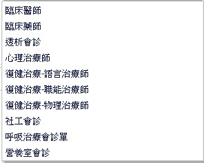

# 住院醫囑 tabPage table

| ==進度== | ==名稱==     | ==Module== | ==Page==                                | ==DB Table==          |
| -------- | ------------ | ---------- | --------------------------------------- | --------------------- |
|          | TPR資訊      |            | EmrQueryTprInfo                         |                       |
| import   | 彙總病例資訊 | emrquery   | EmrQueryMain/emrquery1010               | X                     |
| import   | 查詢檢驗報告 | emrquery   | EmrQueryMainLAB/emrquery1070            | X                     |
|          | 查詢檢查報告 | emrquery   | EmrQueryMainORDER/                      |                       |
| import   | 查詢病例類別 | emrquery   | EmrQueryMainMEDICAL_RECORD/emrquery1040 | X                     |
| import   | 病患就醫紀錄 | oer        | EmrRecord                               | X                     |
| import   | 過敏         | emrquery   | Comm3020                                | X                     |
|          | 一般處方     | ier        | Ier2010                                 |                       |
|          | 診斷維護     | ier        | Ier2020                                 | Form: emrIpdEncounter |
| import   | 化療處方     | comm       | Comm5050/Comm5050newPage                | X                     |
| import   | 開立診斷書   | comm       | Ier2011/Comm5060Page                    | X                     |
| import   | 重要病史     | comm       | Ier2012/Comm3010Page                    | X                     |
|          | 會診單填寫   | comm       | Comm6040Ier/Comm6040Page                |                       |

==會診單填寫→會診單種類==

### 膳食處方

ID(ID)  看診序號encounterNo   膳食醫令序號dietSeq   狀態碼orderState

餐種類別mealType-select(codeType="Diet002")   熱量calorie-input   餐種代碼mealCode-select  

生效日期orderStDate-date   起始餐次stMealTime-select(codeType="Diet004")

結束日期orderEdDate-date   結束餐次edMealTime-select(codeType="Diet004")                 不吃哪餐就停哪餐(??)

膳食類型： 早cbox   午cbox   晚cbox   備註input

餐次類型： 早餐select   午餐select   晚餐select

家屬餐cbox

質地調整： 泥狀cbox   剁碎cbox

禁忌：  豬肉cbox   牛肉cbox   羊肉cbox   雞肉cbox   油炸cbox   辣cbox   魚cbox   蛋cbox   奶cbox   加工品cbox   

最後過餐日期lastPrepareDate  最後過餐餐次lastPrepareMealTime

建構者creatoruserid   建構日期creatortime   異動者lastmodifyuserid   異動日期lastmodifytime

新增通知N    刪除通知D

停餐日期abnormalDate

餐次mealTime

停餐選項action

備註remark

取消此筆cancelFlag
