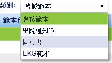
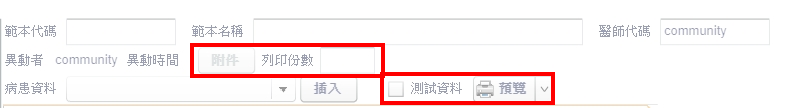

# 同意書範本

> HIS3：設定作業>病歷設定>會診/出院通知單/心電圖範本

## nodeType

Source Table: EmrNoteCategory



```js
var findAllByQueryUtils:HCFindAllByQueryUtil = new HCFindAllByQueryUtil();
findAllByQueryUtils.queryId = "EmrNoteCategory emrNoteCategoryDTO";
findAllByQueryUtils.dtoId = "EmrNoteCategoryDTO";
findAllByQueryUtils.addQueryCriterion("useKind","=","Flex");
findAllByQueryUtils.addQuerySortField("id");
```

```sql
-- EkgReport,EKG範本
-- ConsentNote,同意書
-- Consult,會診範本
-- DischgInform,出院通知單
```

### 範本主檔

Source Table: EmrNoteTemplatemst


```typescript
var queryStr:String = "select t1 from com.hcsaastech.ehis.comm.EmrNoteTemplatemst t1 where t1.noteType = '" + noteType + "' ";
if( noteType != "ConsentNote" ){
  queryStr += "and t1.ownerCode = '" + LoginUserData.getInstance().userName + "' ";
}
// noteType: EkgReport / ConsentNote / Consult / DischgInform
```

## 切換類別

```xml
<mx:Label text="類別:" fontWeight="bold"/>
<mx:ComboBox id="categoryComboBox" dataProvider="{emrNoteCategoryDTOArray}" labelField="typeDesc" change="categoryComboBoxChange()" />	
```

```typescript
public function categoryComboBoxChange():void{
  editor.htmlText = "";
  // 下面這兩行等於把searchKey清空
  searchText.text = "";
  searchKey = searchText.text;

  // 選到同意書的時候，右邊會多出附件按鈕、列印份數 + 測試資料、列印預覽(visible判斷寫在mxml裡)
  fileBtn.visible = fileBtn.includeInLayout = String(categoryComboBox.selectedItem.noteType) == "ConsentNote";
  prtBox.visible = prtBox.includeInLayout = String(categoryComboBox.selectedItem.noteType) == "ConsentNote";

  loadTemplateMDData(String(categoryComboBox.selectedItem.noteType));
}
```



附件按鈕、列印份數

```xml
<mx:Button id="fileBtn" label="附件" click="uploadFile()" enabled="{currentDTO.id > 0}"/>	

<mx:HBox id="prtBox" verticalAlign="middle" horizontalGap="2" visible="false" includeInLayout="false">
  <mx:Label text="列印份數"/>		
  <mx:TextInput enabled="{currentDTO!=null}" id="seqNo" width="50" restrict="0-9"
                focusOut="changeData()" change="changeData()"/>
</mx:HBox>
```

測試資料、列印預覽

```xml
<mx:CheckBox id="chrCheckBox" label="測試資料" selected="false"
             visible="{categoryComboBox.selectedItem.noteType == 'ConsentNote'}" includeInLayout="{categoryComboBox.selectedItem.noteType == 'ConsentNote'}"/>	
<mx:PopUpMenuButton id="printBtn" icon="@Embed(source='/com/hcsaastech/ehis/comm/assets/print_16.png')"
                    visible="{categoryComboBox.selectedItem.noteType == 'ConsentNote'}" includeInLayout="{categoryComboBox.selectedItem.noteType == 'ConsentNote'}"
                    dataProvider="{printBtnData}" showRoot="false" itemClick="printItemClick()"/>
```

```typescript
private var printBtnData:Array = [
  {label: "預覽", code: "preview"},
  {label: "Server 列印", code: "Server"},
  {label: "Applet 列印", code: "Letter"}
];
```

### 搜尋關鍵字

> 不知道怎樣的條件/帳號才能在UI上顯示關鍵字查詢區塊

```xml
<mx:HBox verticalGap="2" horizontalGap="2" verticalAlign="middle"
    visible="{(LoginUserData.getInstance().isAdmin) || (LoginUserData.getInstance().loginType == 'HIS')}" 
    includeInLayout="{(LoginUserData.getInstance().isAdmin) || (LoginUserData.getInstance().loginType == 'HIS')}">
   <mx:Spacer width="10"/>    
   <mx:Label text="搜尋關鍵字:"/>
   <mx:TextInput id="searchText" width="150" change="searchKey = searchText.text" enter="searchKey = searchText.text;rollBack();"/>
   <mx:Button label="搜尋" click="rollBack()"/> 
</mx:HBox>
```

templateCode + templateName

```typescript
if(searchKey != null && searchKey != ""){
  queryStr += "and (t1.templateCode like '" + searchKey + "%' or t1.templateName like '%" + searchKey + "%')";
}
queryStr += "order by t1.templateCode";
```

## 插入病患資料

Source Table: EmrNoteDataobject


```typescript
findAllByQueryUtils.queryId = "EmrNoteDataobject emrNoteDataobjectDTO";
findAllByQueryUtils.dtoId = "EmrNoteDataobjectDTO";
findAllByQueryUtils.addQueryCriterion("openPanel","=","N");
findAllByQueryUtils.addQuerySortField("triggerKind");
findAllByQueryUtils.addQuerySortField("dataobjectName");
```

## From

欄位：

```js
templateCode //範本代碼
templateName //範本名稱
ownerCode //醫師代碼
//異動者
//異動時間
```

## 新建

==his7應該會走的流程==

call完post mst之後取得mstId

=> 新增空白dtl

=> refresh mst

=> 選中剛剛新增的mst

=> refresh dtl

```typescript
// mst
newDTO.ownerCode = LoginUserData.getInstance().userName;
newDTO.noteType = String(categoryComboBox.selectedItem.noteType); // 當前選中nodeType
newDTO.templateKind = "Dept";
newDTO.usageOei = "ALL";
newDTO.templateType = "Template";
newDTO.templateStatus = "Y";
newDTO.templateProperty	= "S";	
newDTO.seqNo = 2;			
// dtl
currentDtlDTO.noteChapter = "Content";
currentDtlDTO.templateNote = "";
```

## 其他

`parseTemplateNote`這個方法猜測裡面是在塞文本區的空格(如果某個欄位是空值的話給多少空格之類的)