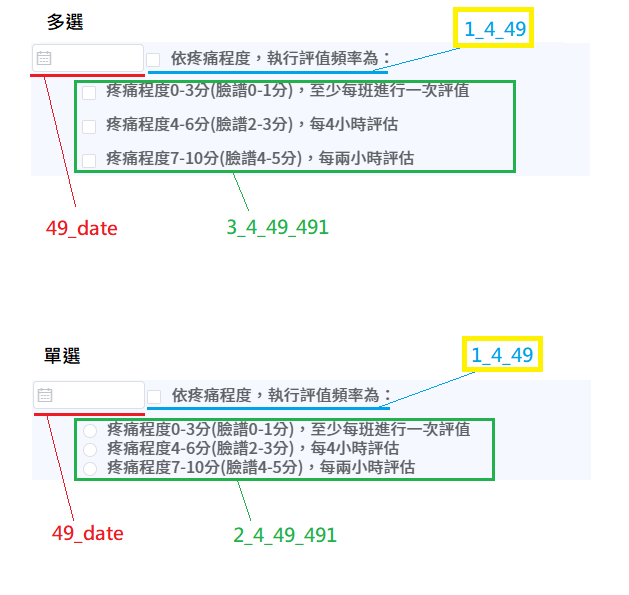

# Plan OBS 控件ID格式

> 字段名不可重複
>
> 且 **控件編號** 為整張表單的唯一值

主要控件

子控件

勾選標題的紀錄日期

### 【第一碼】DisplayType 控件類型：

- 1: 勾選標題
- 2: 單選
- 3: 多選
- 4: 單行輸入框
- 5: 多行輸入框
- 6: 日期
- 7: 下拉
- 8: 標題/項目文字

### 【第二碼】PlanItemType 項目類別：

> NIS Code Table
>
> codeType = 'PlanItemType'

- A: 評值標準
- 1: 鑑別特徵(伴隨症狀)
- 2: 導因
- 3: 目標
- 4: 護理措施
- 6: 家屬聲明
- 7: 入院時精神狀態評估
- 8: 治療計畫
- 9: 廔管評估
- 10: 異常原因
- 21: 危險因子

# 控件ID範例

黃框為該項目中的主要控件

### 嵌套子控件

# 表單結構

摺疊面板 => 柵格容器 => 項目控件

## 勾選標題做法

選擇「多選框組」，並只留一個選項

1. 項目中無子控件：可直接將項目文字定義在多選框組件的選項文字中

   

2. 項目中有子控件：選項文字可放兩個空格，以呈現無文字的勾選框

   