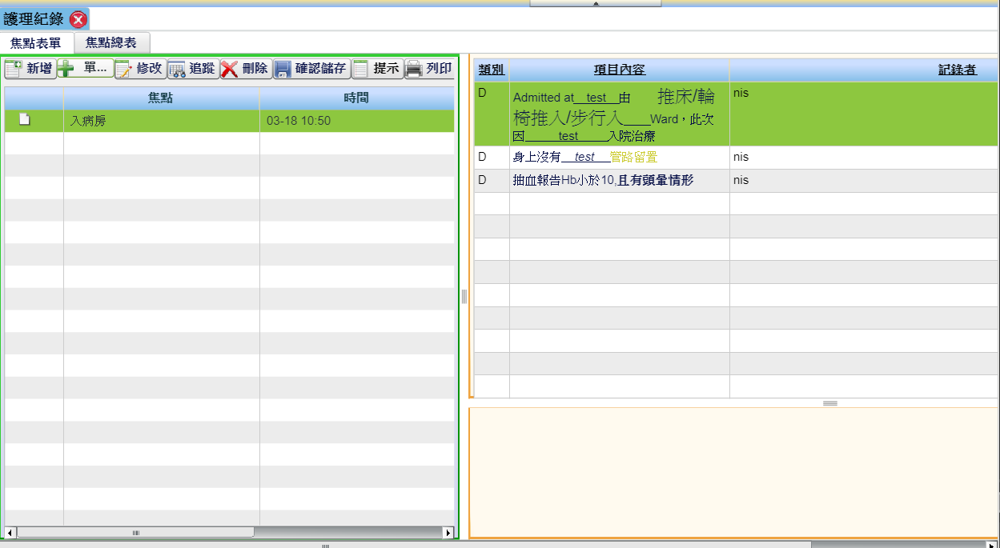

[護理教學0814.mp4](https://drive.google.com/file/d/17EnBuTE3pZDOj-VnSc26fOFYKDt4nmYI/view)

```sql
0:00 -- 焦點維護
8:53 -- 衛教維護
17:25 -- 衛教問卷
26:19 -- 計畫維護
48:31 -- 常用項維護

57:20 -- 護理紀錄
	-[新增] => 57:48 -- 焦點編輯
	
59:54 -- NurseLeader
1:02:58 -- 代簽護理人員設定
```


# 護理紀錄



1. 可以新增項目、可以插入片語：對DAPT標題右鍵

   > 使用chred會遇到的問題：編輯模式沒有插入控件的功能，也沒有插入字典的功能
   >
   > 初步想法：可能要結合後台功能(片語)和設計模式(插入控件)

2. 可以更該文字樣式

   > 使用chred會遇到的問題：目前僅有取得整篇html的方法，沒有只擷取部分html的功能
   >
   > 初步想法：無，無法判斷擷取部分的頭尾

3. 左側選單對應焦點表單的左側Table(焦點)，右側編輯區對應焦點表單的右側Table(類別/項目內容)

4. 勾選並編輯項目 => 儲存帶回 => 右側Table項目內容只會顯示在焦點編輯時有勾選的項目，並呈現文字樣式

# 衛教指導

# 護理計畫