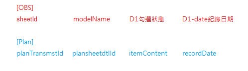

# 護理計畫 nis5020

his3: Nis5020MDListPage

## 表單

NIS_PLANSHEETMST


```sql
-- 護理計畫設定主檔
ID                
ENABLED            '生效註記'
PLAN_SHEET_NAME    '名稱'
PLAN_SHEET_TYPE    '類別'
PLANSHEET_SEQNO    '編號'
SHEET_ID           '表單id'

VERSION           
F_CREATORUSERID    
F_CREATORTIME     
F_LASTMODIFYTIME  
F_LASTMODIFYUSERID
```

NIS_PLANSHEETDTL

```sql
ID
PLANSHEETMST_ID
ENABLED           '生效註記'
DATA_TYPE         '資料型態'
DEFALUT_VALUE     '預設值'
HAS_OTHER         '有其他項'
ITEM_CONTENT      '內容'
ITEM_NAME         '名稱'
ITEM_NOTE         '補充說明'
ITEM_ORDER        '順序'
ITEM_TYPE         '類別'
LIMIT_TYPE        '限制符號'
PARENT_ID         '父項編號'
RELATIVE_ID       '關連項ID'
SAVE_ACTION       '存檔後動作'
SUB_ORDER         '同行順序'

VERSION           
F_CREATORUSERID    
F_CREATORTIME     
F_LASTMODIFYTIME  
F_LASTMODIFYUSERID
```


## 病患護理計畫

NIS_PLAN_TRANSMST

```sql
ID
ENABLED           '生效註記'
ENCOUNTER_NO      '住院序號'
OBS_SHEET_ID      'obsSheetId'
PLAN_REMARK       '備註'
PLAN_SHEET_NAME   '計劃名稱'
PLANSHEETMST_ID   '計劃ID'
SHEET_TRANS_ID    '表單交易單號'
START_DATE        '起始日期'
PLAN_RESULT       '計畫項目內容'
CREATED_NAME      '開立者'
CLOSED_BY         '結案者'
CLOSED_BY_NAME    '結案者'
CLOSED_DATE       '結案日期'
CLOSED_REASON     '結案原因'

VERSION
F_CREATORUSERID    
F_CREATORTIME     
F_LASTMODIFYTIME  
F_LASTMODIFYUSERID
```

NIS_PLAN_TRANSDTL

```sql
ID
PLAN_TRANSMST_ID
PLANSHEETDTL_ID   '計畫項目'
ENABLED           '生效註記'
ITEM_CONTENT      '內容'
RECORD_DATE
RECORD_ID
RECORD_NAME

VERSION
F_CREATORUSERID    
F_CREATORTIME     
F_LASTMODIFYTIME  
F_LASTMODIFYUSERID
```


## UI

### 計畫清單

NisPlanTransmstCustomTable

### 新增計畫視窗

NisPlanSheetLov

### 視窗裡的樹型選單

NisPlansheetmstTree

### 視窗裡的計畫表單

NisPlanTransmstCustomForm


## HIS7-OBS



plan => focus

itemDart用plansheetdtlId去判斷


```js
// 要不要在mst的html內容中放這個句子，到mst那邊要組html的時候再判斷
getPureText(fullRow){
  let text = ''
  fullRow.forEach(item => {
    // 日期輸入框 / 文字輸入框
    if(item.__config__.tag === 'el-date-picker' || item.__config__.tag === 'el-input'){
      text += this.formConfModel[item.__vModel__] || ''
    }
    // 勾選框
    if(item.__config__.tag === 'el-checkbox-group'){
      text += item.__slot__.options[0].label || ''
    }
    // 純文字
    if(item.__config__.tag === 'mytext'){
      text += item.defaultValue || ''
    }
  })
}
```


## 問題紀錄

勾選計畫項目時，自動給的現在日期無法同步更新在視圖上（OBS動態變數名一開始不存在於vue的data中，導致雙向綁定有問題，$set、$forceUpdate也無效，尚未找到解決方法）

原因可能是動態變數的無法成功雙向綁定，因為OBS的變數都是選擇表單後才確定的，vue的data中一開始不存在此變數，無法從綁定值更動視圖(沒有雙向綁定成功，可能只綁了視圖=>變數的這個方向)


