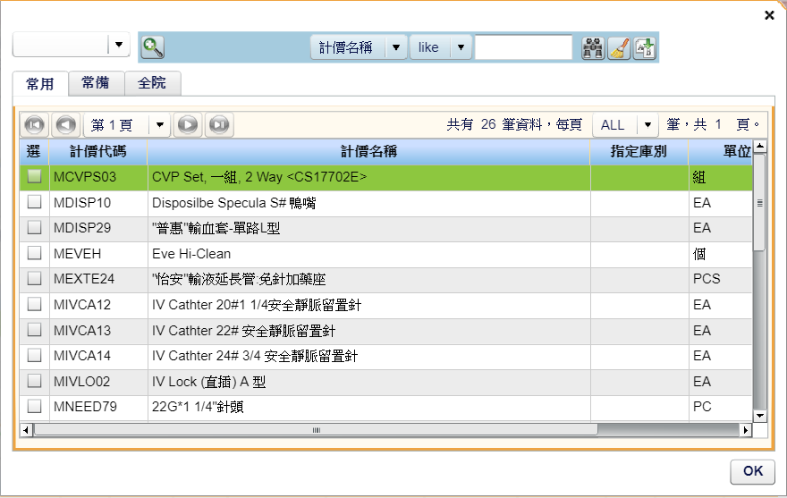

# 醫囑確認

舊: Nis3020

新: Nis3023

方法流程看Nis3023的源碼，保留的舊按鈕再看Nis3020

> **▲ 應該可以合併的查詢**
>
> oneTouch、TcBIL、Residual urine
>
> 來自同一張表，顯示不同的欄位

## 耗材連帶項-新增耗材



```xml
<mx:Button id="addFeePkg" label="新增耗材" paddingTop="0" paddingBottom="0" click="feePkgPopupHandle()" enabled="{this.nisExecuteOrderRecordTable.adg.selectedItem!=null}"/>
```

```typescript
/**
       * Desc：新增耗材PopUp Window.
       * Author Huang
       * Change History：
       * Last Modify author：Huang Date：2009/07/03 Version：1.0
       * change Description：
 */       
public function feePkgPopupHandle():void {
   //var master: NisExecuteOrderRecordNewCustomForm= this["nisExecuteOrderRecordTable"] as  NisExecuteOrderRecordNewCustomForm;//醫囑確認項
   var master:Object        
   if(this["selectedView"]=="1"){       
      master= this["nisExecuteOrderRecordTable"] //as NisExecuteMedRecordNewCustomForm;//醫囑確認項            
   }else if(this["selectedView"]=="2"){
      master= this["nisExecuteOrderRecordTableQ"] //as NisExecuteMedRecordNewCustomForm;//醫囑確認項           
   }
   if(this["executeSelectedItem"]!=null && this["executeSelectedItem"].unsignReason!="A" &&  this["executeSelectedItem"].billingSys=="NIS"){
      var mtrlpopup:NisFeemstTabLov = new NisFeemstTabLov();
      mtrlpopup.page = this;
      
      var  lStockCode:String    =this["costNo"]    as String   //執行地點(庫別)       
      mtrlpopup.invsql = "nisComInvStaioViewDTO.stockCode = '" + lStockCode + "' and (nisComInvStaioViewDTO.currTypeo='1' or nisComInvStaioViewDTO.currTypee='1' or nisComInvStaioViewDTO.currTypei='1') ";
      mtrlpopup.showTab3Flag = true;
      mtrlpopup.invsql2 = "nisComInvStaioViewDTO.stockCode = '" + lStockCode + "' and (nisComInvStaioViewDTO.currTypeo='1' or nisComInvStaioViewDTO.currTypee='1' or nisComInvStaioViewDTO.currTypei='1') and nisComInvStaioViewDTO.feeCode in ('MHEMO19','MHEMO20','MHEMO21','MHEMO22','MHEMO34','MHEMO35','MHEMO08','MHEMO09 ','MHEMO13','MHEMO14','MHEMO18','MHEMO28','MHEMO37','MHEMO15','MBLOO20','MAVFI02','MAVFI03','MAVFI04','MSYRI12','MSYRI13','MSYRI14','MSYRI15','CGLUC06','CFRAG01','CRECO01','CRECO02','CHEPA04','CNS03','CNS07')";
      mtrlpopup.callFunction = true;
      mtrlpopup.openPopUp(this.parentApplication as DisplayObject,true);
   }else if(this["executeSelectedItem"]!=null && this["executeSelectedItem"].unsignReason=="A"){
      Alert.show("補確認醫囑,無法新增項目")
   }else if(this["executeSelectedItem"]!=null && this["executeSelectedItem"].billingSys!="NIS"){
      Alert.show("非護囑入帳,無法新增項目")
   }
}
```

popupLov：NisClient\src\com\hcsaastech\ehis\nis\orderconfirm\view\lov\NisFeemstTabLov.mxml

```typescript
nisCodedtlDTO.codeType='InvA02'
```

### Tabs顯示判斷

prop: orderType

```typescript
if(orderType=="LAB" || orderType=="PAHO" || orderType=="BLD"){
   onlyShow3Flag=true
}
```

- 狀況1 <span style="color:orange">onlyShow3Flag is  false && showTab3Flag is false</span>
  - NisComInvStaioViewTable (常備)
  - NisComFeemstLovTable (全院)
- 狀況2 <span style="color:orange">onlyShow3Flag is  false && showTab3Flag is true</span>
  - NisComInvStaioViewTable2 (常用)
  - NisComInvStaioViewTable (常備)
  - NisComFeemstLovTable (全院)
- 狀況3 <span style="color:orange">onlyShow3Flag is true</span>
  - NisComFeemstLovTable (全院)


# 醫囑確認 按鈕Dialog

## 新增自費項

功能: 新增到醫囑處置作業

HIS7: NisSelfPayGmsDialog

UI位置: top toolbar>新增自費項

Table: comOrdermstExamView

HIS3 Front End Source: NisSlefPayGmsLov

GetQuery:

```xml
queryId="ComOrdermstExamView comOrdermstExamViewDTO"
```

```typescript
private function init():void{
 var query:NisComOrderMstExamViewQurty =new NisComOrderMstExamViewQurty()
 query.criteria=new Array();
 var c1:ZQueryCriterion=new ZQueryCriterion(null,"comOrdermstExamViewDTO.examType in ('GMS1101','GMS1102') and comOrdermstExamViewDTO.enabled='Y' ",null)
 query.criteria.push(c1)
 var op:YOperation=query.execute();
 op.onResult=function(event:YOperationEvent):void{
   if(event.result!=null && event.result.result!=null){
      dataAry= event.result.result as ArrayCollection
   }
 }
}
```

SearchQuery:

```xml
<columns>
  <ZDataGridColumn dataField="orderitemCode" fieldKey="comOrdermstExamViewDTO.orderitemCode" width="120" editable="false" />
  <ZDataGridColumn dataField="displayName" fieldKey="comOrdermstExamViewDTO.displayName" width="250" editable="false" />
  <ZDataGridColumn dataField="qty" fieldKey="comOrdermstExamViewDTO.qty" width="50" editable="true" />		
</columns>
```

<span style="color:orange;border:1px solid; padding: 2px 5px;">進度</span>

- [x] UI
- [ ] DATA

## 輸送作業

> 跨模組：BLOD 血庫

HIS7: 

UI位置: top toolbar>輸送作業

Table: 

HIS3 Front End Source: Blod1050MDtlEditPage

<span style="color:orange;border:1px solid; padding: 2px 5px;">進度</span>

- [ ] UI
- [ ] DATA

## 耗材新增

功能: 新增到醫囑處置作業

HIS7: NisMtrlBasicDialog

UI位置: top toolbar>耗材新增

Table: nisMtrlBasic

HIS3 Front End Source: NisMtrlBasicLov

<span style="color:orange;border:1px solid; padding: 2px 5px;">進度</span>

- [x] UI
- [ ] DATA

## 護理檢驗值

> 先不做，在新版醫囑確認裡也沒有

HIS7: 

UI位置: top toolbar>select>護理檢驗值

Table: 

HIS3 Front End Source: 

🔺功能還沒搞懂

## oneTouch

HIS7: 

UI位置: top toolbar>select>oneTouch

Table: NIS_ONE_TOUCH_DATA

HIS3 Front End Source: Nis3021SgEditPage

<span style="color:orange;border:1px solid; padding: 2px 5px;">進度</span>

- [ ] UI
- [ ] DATA

## TcBIL

HIS7: 

UI位置: top toolbar>select>TcBIL

Table: NIS_ONE_TOUCH_DATA

HIS3 Front End Source: Nis3024SgEditPage

GetQuery:

```
queryId="NisOneTouchData nisOneTouchDataDTO"
```

<span style="color:orange;border:1px solid; padding: 2px 5px;">進度</span>

- [ ] UI
- [ ] DATA

## Residual urine

HIS7: 

UI位置: top toolbar>select>Residual urine

Table: NIS_ONE_TOUCH_DATA

HIS3 Front End Source: Nis3026SgEditPage

GetQuery:

```
queryId="NisOneTouchData nisOneTouchDataDTO"
```

<span style="color:orange;border:1px solid; padding: 2px 5px;">進度</span>

- [ ] UI
- [ ] DATA

## 檢驗列印

HIS7: NisLabPrintDialog

UI位置: top toolbar>檢驗列印

HIS3 Front End Source: NisLabPrintLov

<span style="color:orange;border:1px solid; padding: 2px 5px;">進度</span>

- [x] UI
- [ ] Action

## 檢驗條碼

HIS7: 

UI位置: 醫囑處置作業>search box>檢驗條碼

Table: 

HIS3 Front End Source: NisCheckBarcodeLov

<span style="color:orange;border:1px solid; padding: 2px 5px;">進度</span>

- [ ] UI
- [ ] DATA

## 掃描貼紙

HIS7: BarcodeConfirmDialog

UI位置: 醫囑處置作業>search box>掃描貼紙

Table: 

HIS3 Front End Source: BarcodeConfirmLov

<span style="color:orange;border:1px solid; padding: 2px 5px;">進度</span>

- [x] UI
- [ ] DATA

## 補印貼紙

HIS7: 

UI位置: 醫囑處置作業>search box>補印貼紙

Table: 

HIS3 Front End Source: NisCheckBarcodeLov

<span style="color:orange;border:1px solid; padding: 2px 5px;">進度</span>

- [ ] UI
- [ ] DATA

