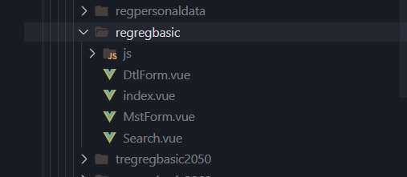
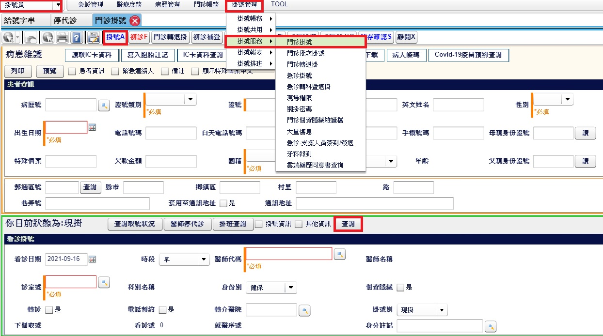
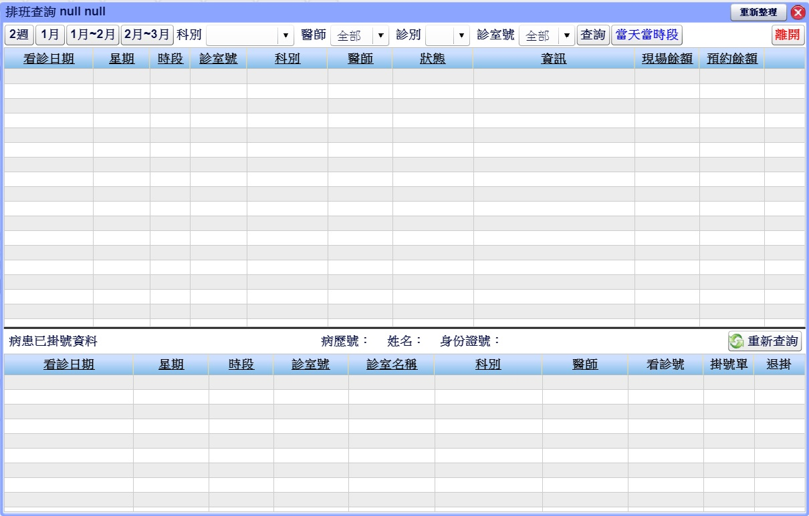
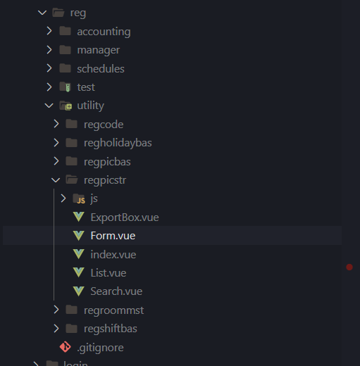
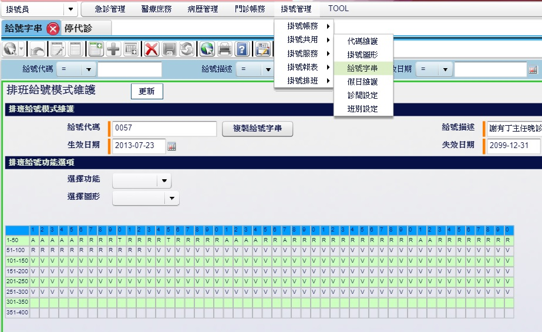
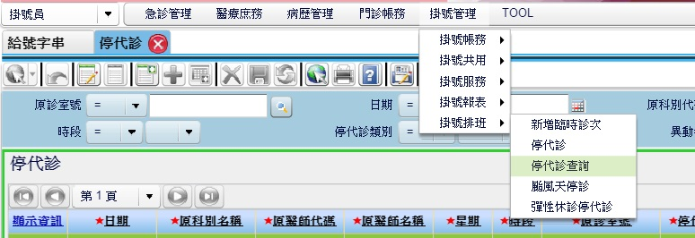
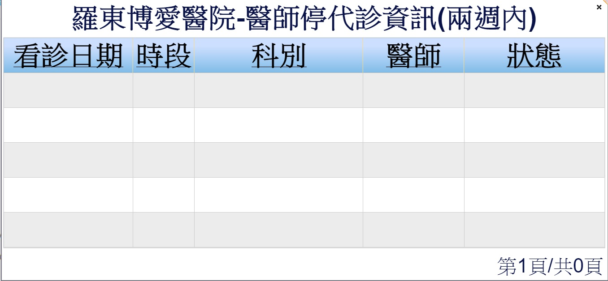
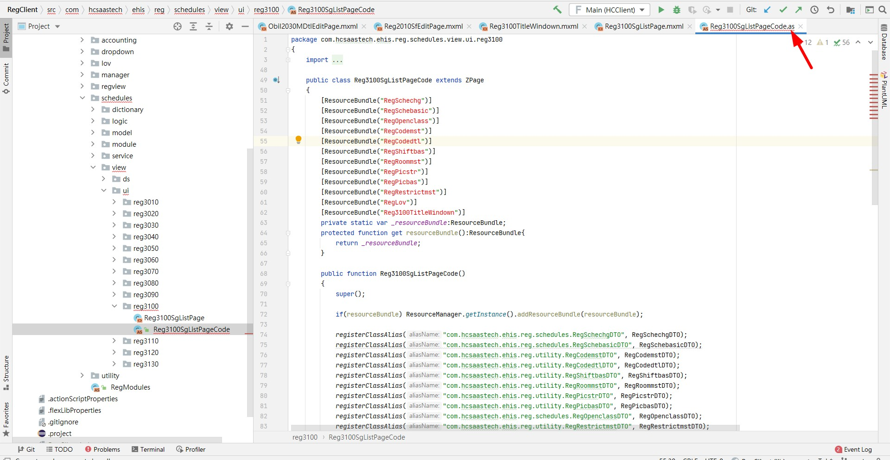
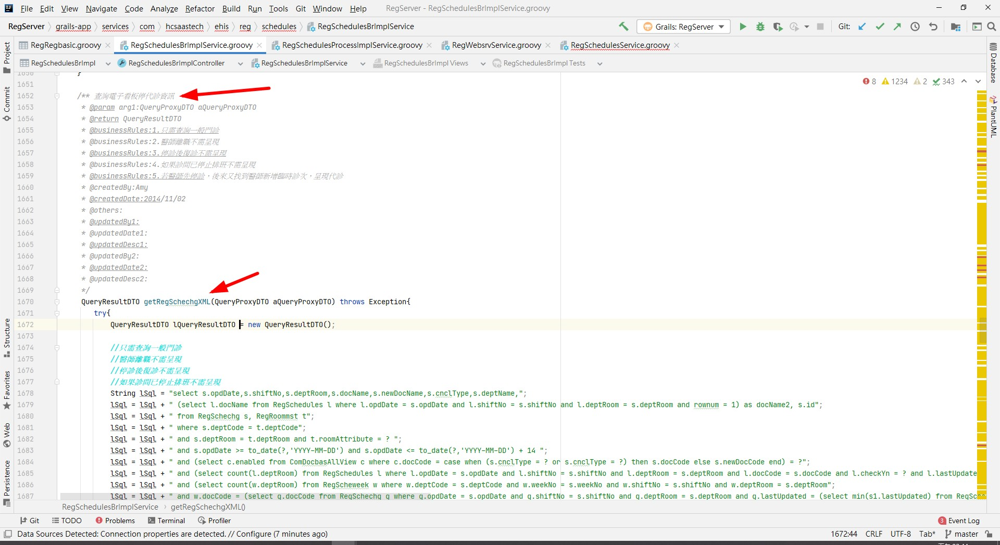

# 門診掛號排班查詢

HIS3：RegClient/src/com/hcsaastech/ehis/reg/manager/view/ds/RegScheduleForm.mxml

> admin/123456
>
> 掛號員 👉 掛號管理/掛號服務/門診掛號  👉 掛號A 👉 查詢

# 給號字串

> admin/123456
>
> 掛號員 👉 掛號管理/掛號共用/給號字串
>
> 下面那個table整張是一個欄位裡面的字串

REG_PICSTR 裡的 `PIC_STRING` 欄位

# 停代診查詢

> admin/123456
>
> 掛號員 👉 掛號管理/掛號排班/停代診查詢
>

# 週排班

# 月班表
