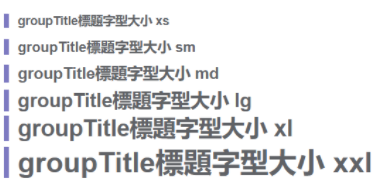
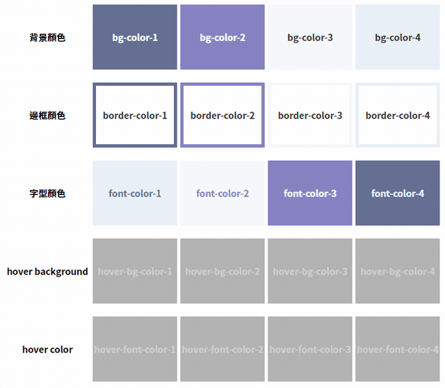
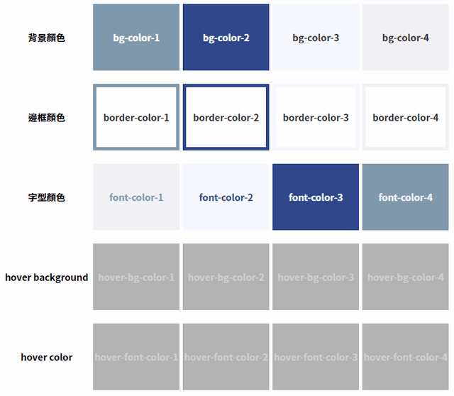

# 標題大小



```html
<groupTitle content="groupTitle標題字型大小 xs" class="xs" />
<groupTitle content="groupTitle標題字型大小 sm" class="sm" />
<groupTitle content="groupTitle標題字型大小 md" class="md" />
<groupTitle content="groupTitle標題字型大小 lg" class="lg" />
<groupTitle content="groupTitle標題字型大小 xl" class="xl" />
<groupTitle content="groupTitle標題字型大小 xxl" class="xxl" />
```

# 主題顏色





```html
<div class="bg-color-1">bg-color-1</div>
<div class="bg-color-2">bg-color-2</div>
<div class="bg-color-3">bg-color-3</div>
<div class="bg-color-4">bg-color-4</div>

<div class="border-color-1">border-color-1</div>
<div class="border-color-2">border-color-2</div>
<div class="border-color-3">border-color-3</div>
<div class="border-color-4">border-color-4</div>

<div class="font-color-1">font-color-1</div>
<div class="font-color-2">font-color-2</div>
<div class="font-color-3">font-color-3</div>
<div class="font-color-4">font-color-4</div>

<div class="hover-bg-color-1">hover-bg-color-1</div>
<div class="hover-bg-color-2">hover-bg-color-2</div>
<div class="hover-bg-color-3">hover-bg-color-3</div>
<div class="hover-bg-color-4">hover-bg-color-4</div>

<div class="hover-font-color-1">hover-font-color-1</div>
<div class="hover-font-color-2">hover-font-color-2</div>
<div class="hover-font-color-3">hover-font-color-3</div>
<div class="hover-font-color-4">hover-font-color-4</div>
```

