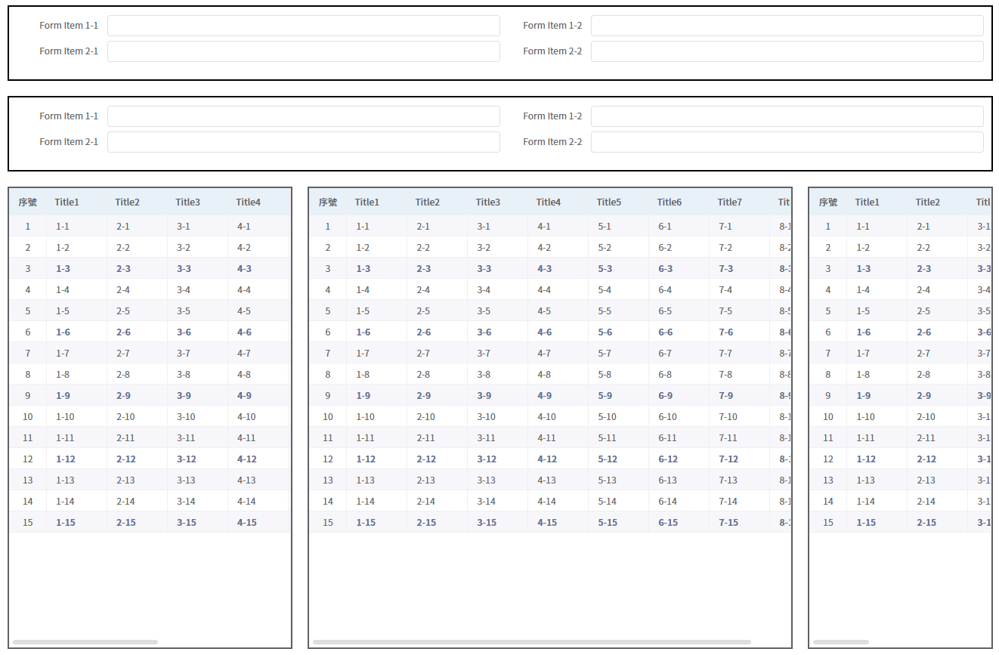
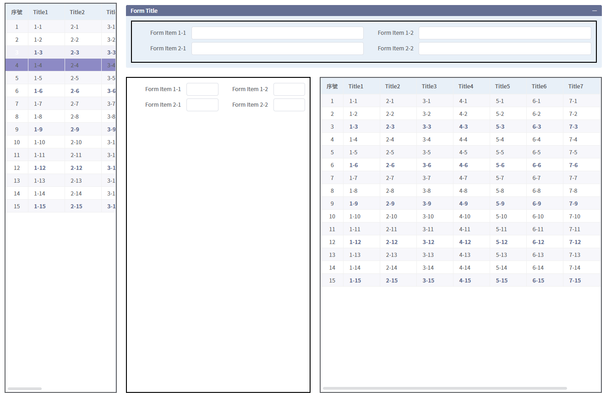

# UI 模板 css class

Demo Page：/his7/demo/chingya/uiTemplate

## 可用的class

> 原理：[flex](https://developer.mozilla.org/zh-CN/docs/Web/CSS/flex)

```css
smhc-inline-box /*內容會橫向擺放*/
smhc-column-box /*內容會縱向擺放*/
smhc-child /*上面兩種box裡面放的子元素*/
flex-grow-1 /*flex-grow: 1; 依照設定比例分配剩餘空間，詳見Example*/
```

### Example:

#### step1

```vue
<!--這是一個寬度1000px的父元素，裡面有一個寬度200px的A元素、B元素、C元素-->
<!--這時父元素中還有400px的寬度沒有被分配-->
<div class="smhc-inline-box" style="width: 1000px">
  <div id="A" class="smhc-child" style="width: 200px"></div>
  <div id="B" class="smhc-child" style="width: 200px"></div>
  <div id="C" class="smhc-child" style="width: 200px"></div>
</div>
```

#### step2

```vue
<!--如果在A元素加上"flex-grow-1"class，表示父元素剩下的400px會被分成一份給A元素-->
<!--A元素的總寬變成了200px + 400px = 600px-->
<div class="smhc-inline-box" style="width: 1000px">
  <div id="A" class="smhc-child flex-grow-1" style="width: 200px"></div>
  <div id="B" class="smhc-child" style="width: 200px"></div>
  <div id="C" class="smhc-child" style="width: 200px"></div>
</div>
```

#### step3

```vue
<!--如果在B元素也加上"flex-grow-1"class，表示父元素剩下的400px會被分成兩份，每份200px，並分配給A、B元素各一份-->
<!--A元素的總寬變成了200px + 200px = 400px-->
<!--B元素的總寬變成了200px + 200px = 400px-->
<!--C元素還是原本的200px-->
<div class="smhc-inline-box" style="width: 1000px">
  <div id="A" class="smhc-child flex-grow-1" style="width: 200px"></div>
  <div id="B" class="smhc-child flex-grow-1" style="width: 200px"></div>
  <div id="C" class="smhc-child" style="width: 200px"></div>
</div>
```


## 應用範例1



```vue
<div class="JNPF-common-layout">
  <div class="JNPF-common-layout-center">
    <!-- 最小高度與寬度預設都只有100px，請依據UI需求設置區塊的最小寬高 -->
    <!-- 當視窗大小縮到小於所有最小寬高的堆疊大小，父層就會長出直/橫向滾動條 -->
    <div class="smhc-column-box">
      <div class="smhc-child pd-10" style="min-height: 120px">
        <Form/>
      </div>
      <div class="smhc-child pd-10" style="min-height: 120px">
        <Form/>
      </div>
      <div class="smhc-child smhc-inline-box flex-grow-1" style="min-height: 350px">
        <div class="smhc-child pd-10" style="width: 30%; min-width: 200px">
          <List/>
        </div>
        <div class="smhc-child pd-10" style="width: 50%; min-width: 200px">
          <List/>
        </div>
        <div class="smhc-child pd-10" style="width: 20%; min-width: 200px">
          <List/>
        </div>
      </div>
    </div>
  </div>
</div>
```


## 應用範例2



```vue
<div class="JNPF-common-layout">
  <div class="JNPF-common-layout-center">
    <!-- 最小高度與寬度預設都只有100px，請依據UI需求設置區塊的最小寬高 -->
    <!-- 當視窗大小縮到小於所有最小寬高的堆疊大小，父層就會長出直/橫向滾動條 -->
    <div class="smhc-inline-box flex-grow-1">
      <div class="smhc-child pd-10" style="width: 20%; min-width: 200px; min-height: 350px">
        <List/>
      </div>
      <div class="smhc-child smhc-column-box" style="width: 80%; min-width: 500px">
        <div class="smhc-child flex-grow-1 pd-10">
          <sub-title title-text="Form Title">
            <Form/>
          </sub-title>
        </div>
        <div class="smhc-child smhc-inline-box flex-grow-1" style="min-height: 350px;">
          <div class="smhc-child pd-10" style="width: 40%; min-width: 250px">
            <Form style="height: 100%"/>
          </div>
          <div class="smhc-child pd-10" style="width: 60%;">
            <List/>
          </div>
        </div>
      </div>
    </div>
  </div>
</div>
```

