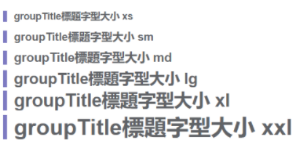
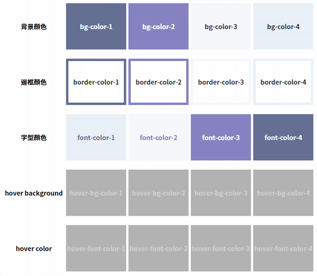
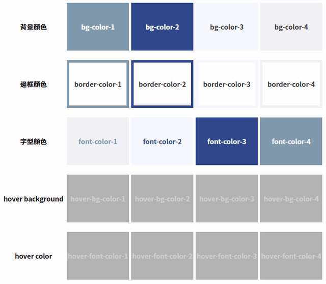
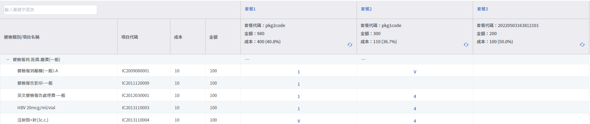
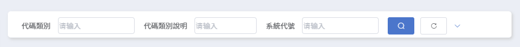
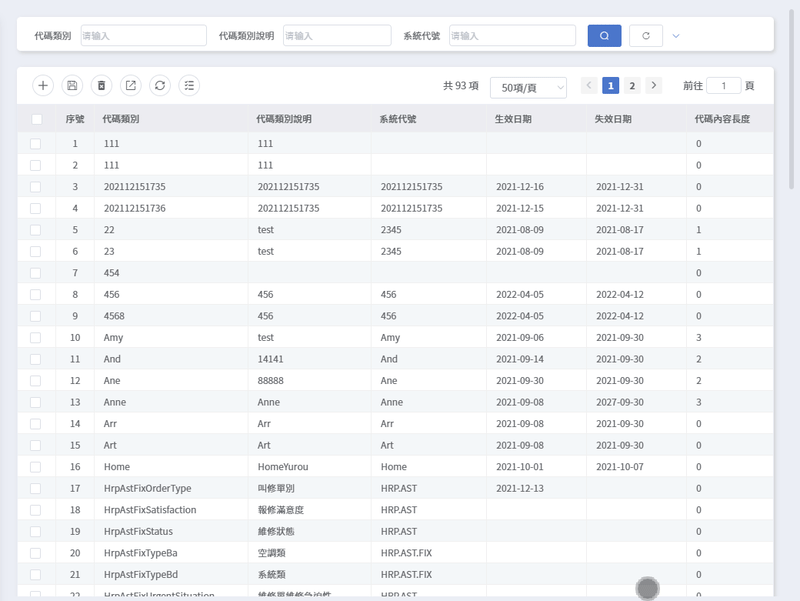

# CSS Common Class

## 標題大小

> 應用於groupTitle組件的標題大小選項



```html
<groupTitle content="groupTitle標題字型大小 xs" class="xs" />
<groupTitle content="groupTitle標題字型大小 sm" class="sm" />
<groupTitle content="groupTitle標題字型大小 md" class="md" />
<groupTitle content="groupTitle標題字型大小 lg" class="lg" />
<groupTitle content="groupTitle標題字型大小 xl" class="xl" />
<groupTitle content="groupTitle標題字型大小 xxl" class="xxl" />
```

## 主題顏色

> 應用後會自動隨使用者的主題設定換色
>
> - **例外：**設置`append-to-body`的 el-dialog 組件，或任何不在 App（`<div id="#app">`，以下簡稱 App）底下的區塊（EX：el-popover、el-tooltip、el-option 等懸浮元件），將無法被套用主題色
>
> - **原因：**主題色是藉由 App 區塊綁定的class名來對底下的子孫元素設置樣式，若非 App 的子孫元素則超出設置範圍，故不生效；
>
>   例如設置`append-to-body`的 el-dialog 組件會成為`<body>`標籤的第一層子元素，與 App 為兄弟關係，無法被 App 的樣式所影響。





```html
<!-- 背景色 -->
<div class="bg-color-1">bg-color-1</div>
<div class="bg-color-2">bg-color-2</div>
<div class="bg-color-3">bg-color-3</div>
<div class="bg-color-4">bg-color-4</div>

<!-- 框線顏色 -->
<!-- 1. 共用選擇器（border-color-num）僅提供框線顏色，請依需求設置框線粗細/線條樣式，若不設置則無法顯示框線 -->
<!-- 2. 使用「border」描述粗細/線條樣式：不可寫於行內樣式（style屬性） -->
<!-- 3. 使用「border-width」 + 「border-style」描述粗細/線條樣式：不限 -->
<!-- 以下四個範例皆為可行的做法 -->
<div class="has-border border-color-1">border-color-1</div>
<div class="border-color-2 has-border">border-color-2</div>
<div class="border-color-3" style="border-style: solid; border-width: 5px;">border-color-3</div>
<div class="has-border2 border-color-4">border-color-4</div>

<!-- 文字顏色 -->
<div class="font-color-1">font-color-1</div>
<div class="font-color-2">font-color-2</div>
<div class="font-color-3">font-color-3</div>
<div class="font-color-4">font-color-4</div>

<!-- 滑鼠游標移過(hover)時的背景色 -->
<div class="hover-bg-color-1">hover-bg-color-1</div>
<div class="hover-bg-color-2">hover-bg-color-2</div>
<div class="hover-bg-color-3">hover-bg-color-3</div>
<div class="hover-bg-color-4">hover-bg-color-4</div>

<!-- 滑鼠游標移過(hover)時的文字顏色 -->
<div class="hover-font-color-1">hover-font-color-1</div>
<div class="hover-font-color-2">hover-font-color-2</div>
<div class="hover-font-color-3">hover-font-color-3</div>
<div class="hover-font-color-4">hover-font-color-4</div>
```

```css
/*border style/width setting example*/
.has-border{
  border: 5px solid;
}
.has-border2{
  border-style: solid;
  border-width: 5px;
}
```


## 多級表頭顯示表頭框線

table-multiple-header



```vue
<JNPF-table 
  :data="list" 
  class="table-multiple-header"
>
	<!-- 多級表頭的做法可查閱Element UI官方網站/Table分類 -->
</JNPF-table>
```


## 圓角方塊

border-radius-box



```vue
<search :parentQuery.sync="query"
        :parentListQuery.sync="listQuery.MstList"
        @initData="initData"
        @reset="reset"
        class="border-radius-box"
/>
```

如果要在tabs組件上套用圓角，需在外面再包一層div標籤，並把`margin-top`歸零

```vue
<div class="border-radius-box">
   <el-tabs style="margin-top:0"></el-tabs>
</div>
```


## 單一滾動條 MD 版型

範例：\views\his7\demo\chingya\scrollbarMD\index.vue



### index.vue

```vue
<div class="JNPF-common-layout">
  <div class="JNPF-common-layout-center">
    <!--在search外多加一層class名為"ui-style-scroll main"的div-->
    <div class="ui-style-scroll main">
      <!--search加上"ui-style-scroll"類-->
      <search class="ui-style-scroll border-radius-box"/>
      <!--將"JNPF-common-layout-main JNPF-flex-main"改為"ui-style-scroll"，並從包MD變為包到MstList就好-->
      <div class="ui-style-scroll border-radius-box mgt-20 bg-w">
        <Header/>
        <!--設置最小高度-->
        <MstList style="min-height: 300px;"/>
      </div>
      <!--新增一層class名為"ui-style-scroll"的div-->
      <div class="ui-style-scroll border-radius-box mgt-20 bg-w">
        <el-tabs type="border-card" style="margin-top: 0;">
          <el-tab-pane>
            <Header/>
            <!--設置最小高度-->
            <DtlList style="min-height: 300px;"/>
          </el-tab-pane>
          <el-tab-pane>
            <Header/>
            <!--設置最小高度-->
            <Dtl2List style="min-height: 300px;"/>
          </el-tab-pane>
        </el-tabs>
      </div>
    </div>
  </div>
</div>
```

```css
.mgt-20{
  margin-top: 20px;
}
.bg-w{
  background: white;
}
```

### MstList / DtlList / Dtl2List

> 在list vue程式中，JNPF-table外再加一層`<div class="ui-style-scroll">`
>
> table組件不能給高度，否則就會各自單獨長出滾動條

```vue
<div class="ui-style-scroll">
  <JNPF-table
    :data="list"
    height=""
  >
  </JNPF-table>
</div>
```

