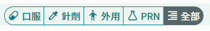

# 圓角單選按鈕組

el-button-group模擬el-radio-button

> el-radio-button沒有圓角屬性可使用
>
> 並且 radio 組件只提供 change 事件，若同時有 <u>切換類別</u> + <u>第二次選中按鈕也可以觸發功能</u> 的需求時，以 button 的 click 事件代替可能會較好處理



vue

```vue
<el-button-group>
  <el-button
             v-for="(item, index) in barcodeTypeBtnGroup"
             :key="index"
             :icon="item.icon"
             round
             plain
             type="primary"
             :class="{'active-btn': barcodeType === item.value,
                     'bg-color-1': barcodeType === item.value,
                     'border-color-2': barcodeType !== item.value}"
             @click="chnageBarcodeType(item.value)"
             >
    {{ item.label }}
  </el-button>
</el-button-group>
```

css

```scss
.active-btn {
  color: #fff;
}
```

js

```js
data(){
  return{
    barcodeType: 'K',
    barcodeTypeBtnGroup: [
      {label: '口服', value: 'K', icon: 'ym-custom ym-custom-pill'},
      {label: '針劑', value: 'C', icon: 'ym-custom ym-custom-eyedropper-variant'},
      {label: '外用', value: 'W', icon: 'ym-custom ym-custom-human-handsdown'},
      {label: 'PRN', value: 'Z', icon: 'ym-custom ym-custom-flask-empty-outline'},
      {label: '全部', value: 'A', icon: 'ym-custom ym-custom-format-align-right'},
    ],
  }
},
methods: {
  chnageBarcodeType(type){
    this.barcodeType = type
    this.doSomething(type)
  },
}
```

