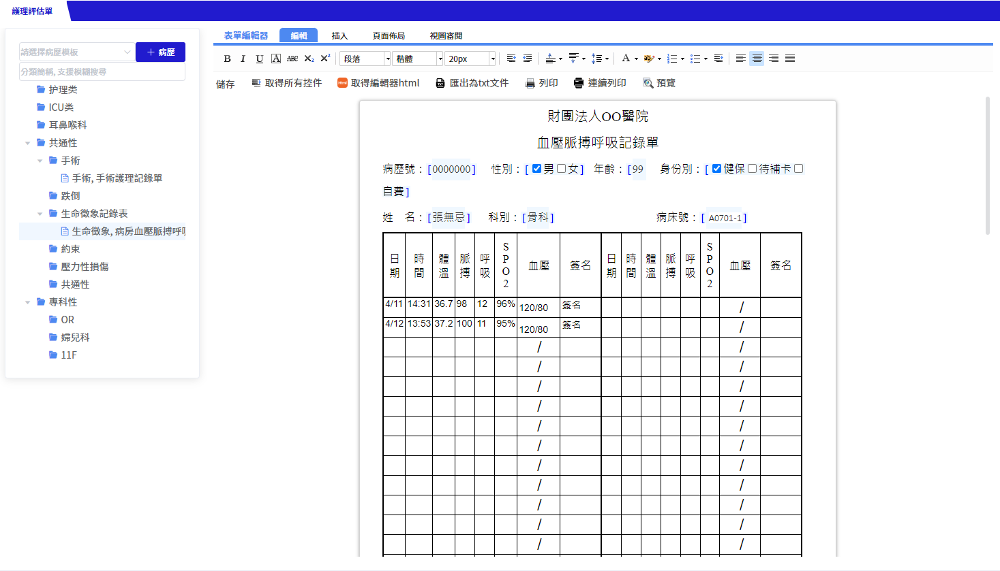
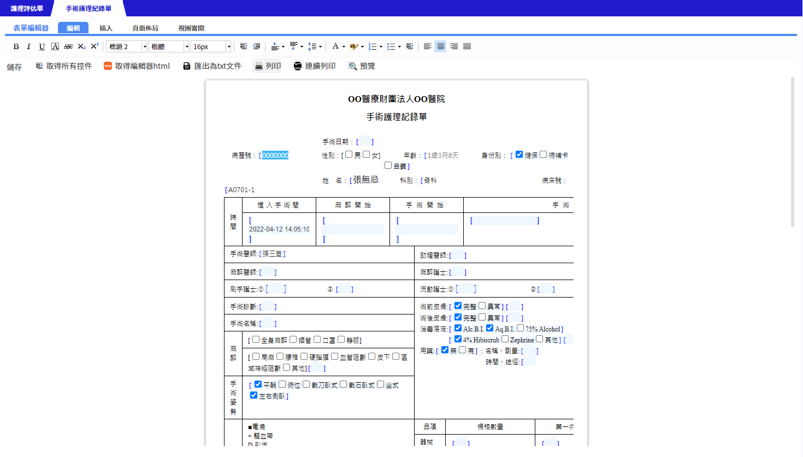

# ChratEditor使用範例

範例路徑：his7/demo/chred/chartEditor

## 注意事項

**editorId 是必填的欄位，請給一個全局的唯一固定值。**

> Chred底層的ueditor組件靠editorId來辨識當前編輯器，若全局中有兩個editorId相同的編輯器會造成渲染失敗。
>
> ※不建議使用會更動的值來當editorId，例如：轉跳路徑重新讀取已開啟的頁面，但給的editorId和上次開啟時不同(EX: 用現在時間當ID)，可能會造成組件判斷此頁面需要渲染兩個編輯器。

## 編輯模式 mod

預設為readonly

```vue
<template>
  <div class="JNPF-common-layout">
    <div class="JNPF-common-layout-center">
      <chartEditor :config="config"/>
    </div>
  </div>
</template>

<script>
import chartEditor from '@/components/iAlice/ChartEditor'
export default {
  components: {chartEditor},
  data(){
    return{
      config: {
        editorId: 'demo-chred',
        mod: 'edit', // edit / readonly / review / trace
      }
    }
  }
}
</script>
```

## 應用模式 searchKind

預設為DEFAULT

### 應用模式一：有樹型選單



```vue
<template>
  <div class="JNPF-common-layout">
    <div class="JNPF-common-layout-center">
      <chartEditor :config="config"/>
    </div>
  </div>
</template>

<script>
import chartEditor from '@/components/iAlice/ChartEditor'
export default {
  components: {chartEditor},
  data(){
    return{
      config: {
        editorId: 'demo-chred',
        mod: 'edit', 
        searchKind: 'DEFAULT', // DEFAULT / SHEET / UNIT
        query: { // 查詢參數
          encounterNo: 'I12090392', 
          chartNo: '1050888'
        }
      }
    }
  }
}
</script>
```

#### query有效欄位

searchKind=`DEFAULT`：

- encounterNo
- chartNo
- sheetId

searchKind=`SHEET`：

- encounterNo
- chartNo
- sheetType
- ownerType

searchKind=`UNIT`：

- encounterNo
- chartNo
- sheetType
- ownerType
- unit：必填

### 應用模式二：無樹型選單



```vue
<template>
  <div class="JNPF-common-layout">
    <div class="JNPF-common-layout-center">
      <chartEditor :config="config"/>
    </div>
  </div>
</template>

<script>
import chartEditor from '@/components/iAlice/ChartEditor'
export default {
  components: {chartEditor},
  data(){
    return{
      config: {
        editorId: 'demo-chred',
        mod: 'edit',
        searchKind: 'ONE_SHEET', // ONE_SHEET
        query: { // 查詢參數
          encounterNo: 'I12090392',
          chartNo: '1050888'
        }
      }
    }
  }
}
</script>
```

#### query有效欄位

searchKind=`ONE_SHEET`：

- transId
- encounterNo
- chartNo
- sheetId
