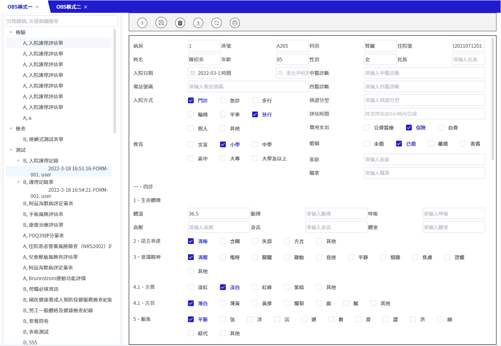
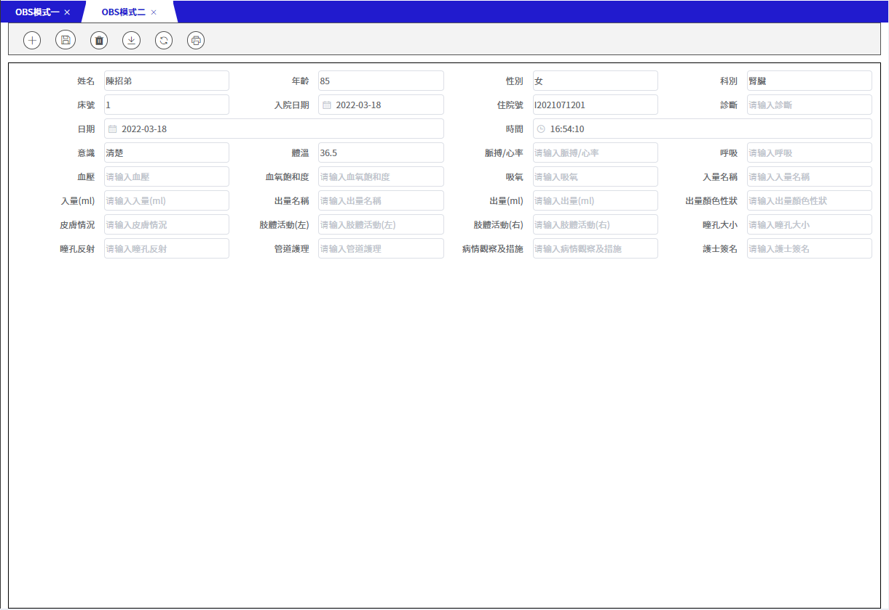
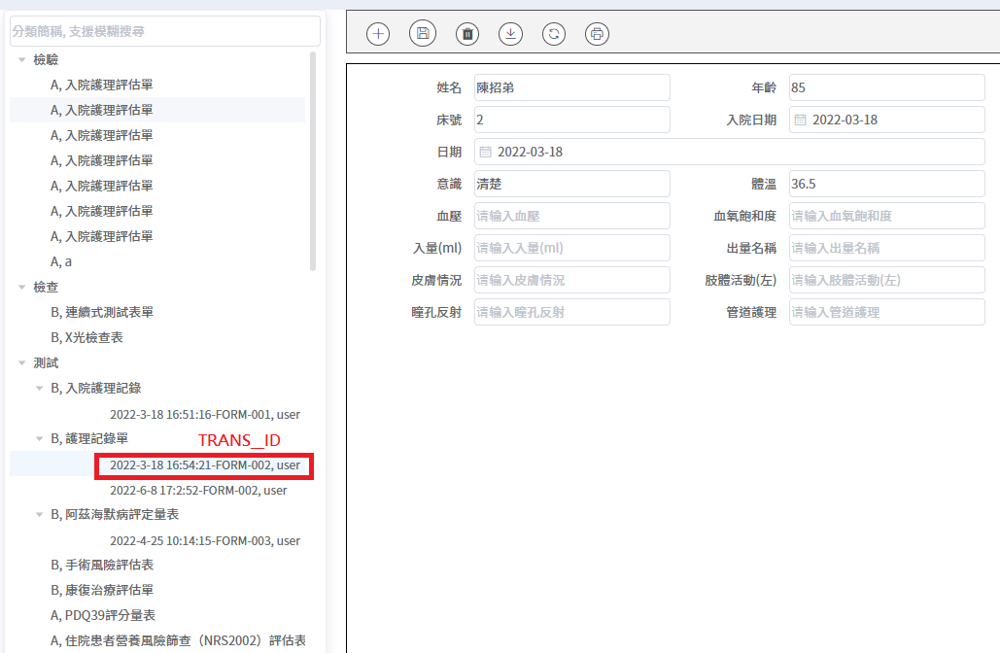
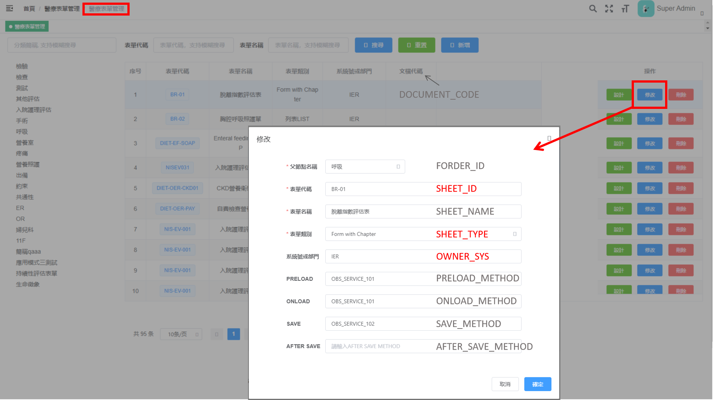
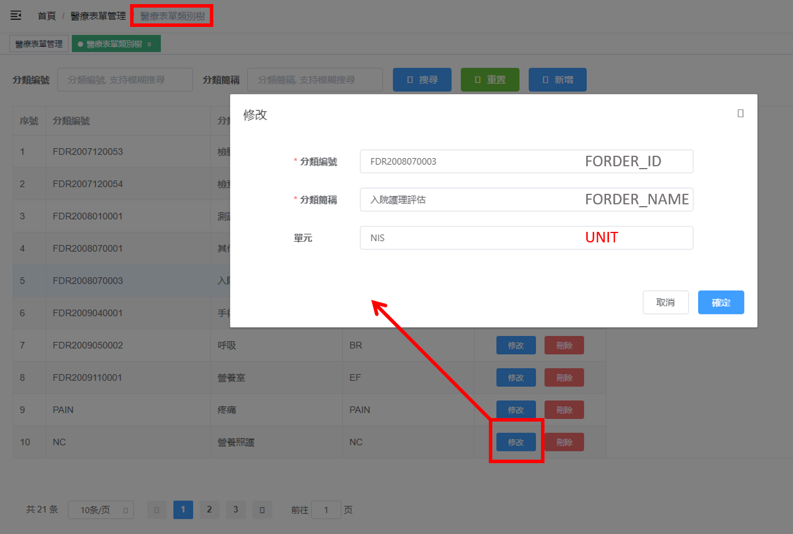

# OBS使用範例

範例路徑：his7/demo/obs

## 編輯模式 mod

預設為readonly

```vue
<template>
<div class="JNPF-common-layout">
  <div class="JNPF-common-layout-center">
    <obs :config="config"/>
  </div>
</div>
</template>

<script>
import obs from '@/components/iAlice/OBS/views/index'
export default {
  components: {obs},
  data(){
    return{
      config: {
        mod: 'edit', // readonly / edit
      }
    }
  }
}
</script>
```

## 應用模式 searchKind

預設為DEFAULT

### 應用模式一：有樹型選單



```vue
<template>
<div class="JNPF-common-layout">
  <div class="JNPF-common-layout-center">
    <obs :config="config"/>
  </div>
</div>
</template>

<script>
import obs from '@/components/iAlice/OBS/views/index'
export default {
  components: {obs},
  data(){
    return{
      config: {
        mod: 'edit', 
        searchKind: 'DEFAULT', // DEFAULT / UNIT
        query: { // 查詢參數
          chartNo: '1050888',
          encounterNo: 'I2021071201'
        }
      }
    }
  }
}
</script>
```

#### query有效欄位

searchKind=`DEFAULT` ：

- encounterNo
- chartNo
- sheetId 
- sheetType
- ownerSys

searchKind=`UNIT` ：

- encounterNo
- chartNo
- sheetId 
- sheetType
- ownerSys
- unit：必填

### 應用模式二：無樹型選單



```vue
<template>
  <div class="JNPF-common-layout">
    <div class="JNPF-common-layout-center">
      <obs :config="config"/>
    </div>
  </div>
</template>

<script>
import obs from '@/components/iAlice/OBS/views/index'
export default {
  components: {obs},
  data(){
    return{
      config: {
        mod: 'edit',
        searchKind: 'ONE_SHEET', // ONE_SHEET
        query: {
          chartNo: '1050888',
          encounterNo: 'I2021071201',
          sheetId: 'FORM-002'
        }
      }
    }
  }
}
</script>
```

#### query有效欄位

searchKind=`ONE_SHEET` ：

- transId
- encounterNo
- chartNo
- sheetId

## 就醫序號與病歷號

存檔時會從config取得要存的就醫序號(IPD_NO)及病歷號(CHART_NO)

## 欄位和UI

### 前台



### 後台



