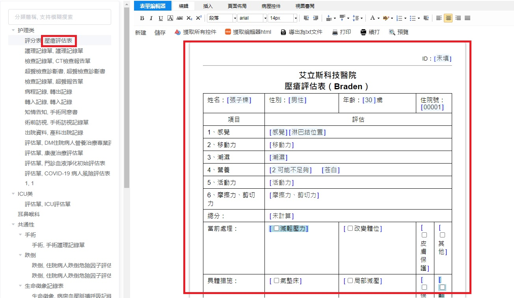
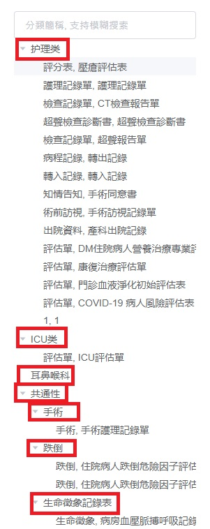

<h1>病歷組件ChrEd</h1>

# 基本設定

## DB

MySQL

IP: 192.168.1.176

user: ching

password: welcome1

(Schema: chred)


## run

API(後端)：用終端機打開package.json，執行`node server.js`

vueemreditor(前台前端)：用終端機打開package-lock.json，執行 `npm run dev`


## jnpf內

### 1. API的設定

1. define.js  -chartEditorServer

2. baseUrl: iAlice-ChartEditor-utils-request.js

3. vue.config.js-proxy-/chartEdittorServer


### 2. 組件

his7-demo-strong-chartEditor-index.vue = 外部單獨的App.vue

資料流程：(可閱Readme.md的前後端串接)


### 3. call api

api => router => controller

app/model/sheet.def.model(Table和欄位)

app/controllers/sheetdef.controller(有接收的參數設定，但目前前端都沒有代參數所以會傳所有資料回來)

左邊的tree call `sheetInfo` 和 `order`


### 4. gitlab project

http://192.168.1.159/charles_his7_grp/chred

master和develop是給Freelancer用的(master目前版，develop上一版)

內部更動的部分放smhc，其他兩個分支不要動


# Table

## 表單定義 sheetDef 

> 設計表單
>
> 一個sheetId對到一個表單設計

DB Table: chred_sheet_def

variableName: sheetdef (定義在models/index.js)


api: `/api/sheet/sheetInfo`

routes=>controller: `router.get("/sheetInfo", sheetdefs.sheetInfo)`

參數： (查詢單一表單時用，撈完整樹型不用傳參)

| column_name | desc                   |
| ----------- | ---------------------- |
| forderId    | 表單文件分類           |
| sheetType   | 表單類別(A 多筆B 唯一) |

資料範例：

| DOCUMENT_CODE | SHEET_ID | SHEET_NAME | SHEET_TYPE | DEPT_NO | OWNER_SYS | FORDER_ID | 一堆空欄位 | SHEET_HTML |
| ------------- | -------- | ---------- | ---------- | ------- | --------- | --------- | ---------- | ---------- |
| 評分表        | N004     | 壓瘡評估表 | 評分表     | NIS     | NIS       | 1         |            | *(html)*   |




## 表單類別設定 forder 

> 樹型資料夾關係(分類)
>
> 覺得打錯字，應該是folder吧…

DB Table: chred_forder

variableName: forder (定義在models/index.js)


api: `/api/order/orderInfo`

routes=>controller: `router.get("/orderInfo", forders.orderInfo)`

參數：`forderId`, `forderName` (查詢單一分類時用，撈完整樹型不用傳參)

資料範例：

| FORDER_ID  | PARENT_FORDER_ID | FORDER_NAME | UNIT     |
| ---------- | ---------------- | ----------- | -------- |
| 1          |                  | 護理類      | 護理科室 |
| COMMON     |                  | 共通性      | COMMON   |
| OR         | COMMON           | 手術        |          |
| SPECIALIST |                  | 專科性      |          |
| GP         | SPECIALIST       | 婦兒科      |          |




## 交易主檔 transMst

> 填寫表單資料

DB Table: chred_trans_mst

variableName: transmst (定義在models/index.js)


api: `/api/transmst/transmstInfo`

routes=>controller:  `router.get("/transmstInfo", transmsts.transmstInfo)` 

參數：`sheetId` 

<b style="color:royalblue">這裡後端參數沒有接收chartNo和encounterNo，可能要加(沒辦法查詢單一病患及單次就醫)</b>

<span style="color:royalblue">API/charteditor-nodejs-express/app/controllers/transmst.controller.js/transmstInfo()</span>

資料範例：

| TRANS_ID | CHART_NO   | ENCOUNTER_NO | OWNER_SYS | SHEET_ID | SHEET_NAME | SHEET_HTML           | SHEET_TEXT           |
| -------- | ---------- | ------------ | --------- | -------- | ---------- | -------------------- | -------------------- |
| *(主鍵)* | *(病歷號)* | *(就醫序號)* | EMR       | N005     | 護理紀錄單 | *(含填寫資料的html)* | *(填寫資料的純文字)* |


## 交易明細 transDtl

> 表單內的可編輯欄位，對應 transmst 的 transId

單獨存所有控件的值，方便外部調用特定欄位

api: `/api/transdtl/transdtlInfo`

| TRANS_ID       | SHEET_ID | ITEM_ID | ITEM_NAME | ITEM_EDIT_TYPE | ITEM_VALUE |
| -------------- | -------- | ------- | --------- | -------------- | ---------- |
| *(交易主檔ID)* | N005     | field08 | 姓名      | input          | 王曉明     |
| *(交易主檔ID)* | N005     | field09 | 性別      | radio          | 男         |


## <span style="font-size:50px">QUERY</span>

### 前端

> App.vue

<b style="border: 1px solid darkkhaki;color:darkkhaki;padding: 3px 5px;">前端源碼流程</b>

點擊樹型清單項目，以項目的sheetId為關聯鍵查transMst

query沒有傳chartNo和encounterNo，response如果有兩筆資料則取第一筆


<b style="border:1px solid darkkhaki;color:darkkhaki;padding:3px 5px;">應該要改成</b>

不採用❌<span style="color:royalblue">**（狀況一）顯示所有種類的表單**：</span>

問題：點進樹型項目才知道有沒有已經編輯過的表單(不確定能不能靠highlight增加辨識度)

1. <span style="color:royalblue">單次就醫中同表單只能編輯一份</span>

   - 同源碼流程：sheetInfo(all) => orderInfo(all) => 塞樹型 => 點選樹型項目(get sheetId) => transMst(sheetId **+ encounterNo**)

   - 傳encounterNo以避免response有兩筆以上，但如果未來還有需要顯示多筆同類表單的需求，view可能需要重寫

2. <span style="color:royalblue">同表單可以編輯多份</span>

​		<span style="color:royalblue">2-1 只顯示單層樹型(完整sheetInfo+orderInfo)</span>

- 如果是存有多份填寫資料的表單類型，點進樹型項目後再選擇要開啟哪一份

```vue
<el-select v-model="currentTransSheet" @change="selectTransSheet">
  	<el-option v-for="(item, index) in transSheetList" :key="index"
     		:label="item.SHEET_NAME + item.TRANS_ID"
        :value="item.TRANS_ID"
     ></el-option>
</el-select>
```

````js
export default{
  data(){
    return{
      currentTransSheet: undefined,
      transSheetList: [],
    }
  },
  methods:{
    conceptTreeNodeClick(data){
      // (省略源碼取sheetId的過程)
      transmstInfo({SHEET_ID:data.SHEET_ID})
        .then(response => {
        var transList = response.data.result.rows
        if(transList.length > 0) {
          // 顯示選項
          this.transSheetList = transList
        }
        if(transList.length === 0 || transList[0].SHEET_HTML === null) {
          this.editor.setContent(html)
        } else {
          this.editor.setContent(html)
          // this.editor.setContent(transList[0].SHEET_HTML)
        }
      })
        .catch(() => {
        this.editor.setContent(html)  
      })
    },
    selectTransSheet(newVal){
      localStorage.setItem("TRANS_ID", newVal)
    }
  }
}
````

<span style="color:royalblue">		2-2 顯示所有項目</span>

- 把多份已填寫的表單也加進樹型，判斷過程較麻煩

- 流程：sheetInfo(all) => orderInfo(all) => transMst(encounterNo) => 遞迴sheetInfo和transMst，如果transMst中存在該類表單，直接加transMst的資料到樹型中，如果沒有再加原本的sheetInfo項目

```js
export default{
  data(){
    return{
      list: [], //sheetInfo
      orderTreeData: [], //orderInfo
      allTransList: [], //transMst
      allSheetTypeAndTrans: []
    }
  },
  methods:{
    getTransMst(){
      transmstInfo({ENCOUNTER_NO: this.patData.encounterNo}).then(res => {
        this.allTransList = res.data.result.rows

        this.list.forEach(sheet=>{
          let hasTrans = false
          this.allTransList.forEach(trans=>{
            if(trans.SHEET_ID === sheet.SHEET_ID){
              hasTrans = true
              let item = trans
              item.SHEET_TITLE = sheet.SHEET_TYPE + ", " + trans.SHEET_NAME
              item.FORDER_ID = sheet.FORDER_ID
              this.allSheetTypeAndTrans.push(item)
            }
          })
          if(!hasTrans){
            let item = sheet
            item.SHEET_TITLE = sheet.SHEET_TYPE + ", " + sheet.SHEET_NAME
            this.allSheetTypeAndTrans.push(item)
          }
        })

        this.orderTypeData.forEach(forder=>{
          this.getChildren(forder)
        })

      })
    },
    getChildren(forder){
      forder.SHEET_TITLE = forder.FORDER_NAME
      if(!forder.children){
        forder.children = this.allSheetTypeAndTrans.filter(t=>t.FORDER_ID === forder.FORDER_ID)
      }else{
        forder.children.forEach(c=>{
          this.getChildren(c)
        })
      }
    }
  }
}
```

採用✅<span style="color:royalblue">**（狀況二）只顯示有編輯過的表單，新增表單從別的地方選：**</span>

不論是只能編輯一份還是可以編輯多份都是以下流程

- 流程：sheetInfo(all) => orderInfo(all) => transMst(encounterNo) => 用sheetInfo.forderId+transMst.sheetId對應和transMst和forder(orderInfo)的關係，把transMst的資料直接加到樹型

```js
// 先跳過SHEET_STYLETYPE
export default{
  data(){
    return{
      list: [], //sheetInfo
      orderTreeData: [], //orderInfo
      allTransList: [], //transMst
    }
  },
  methods:{
    getTransMst(){
      transmstInfo({ENCOUNTER_NO: this.patData.encounterNo}).then(res => {
        this.allTransList = res.data.result.rows

        this.allTransList.forEach(t => {
          this.list.forEach(s => {
            if (t.SHEET_ID === s.SHEET_ID) {
              t.SHEET_TITLE = s.SHEET_TYPE + ", " + t.SHEET_NAME
              t.FORDER_ID = s.FORDER_ID
            }
          })
        })
        this.orderTreeData.forEach(folder => {
          this.getChildren(folder)
        })
        this.orderTreeData = JSON.parse(JSON.stringify(this.orderTreeData))
      })
    },
    getChildren(folder) {
      this.$set(folder, 'SHEET_TITLE', folder.FORDER_NAME)
      if (!folder.children) {
        folder.children = this.allTransList.filter(t => t.FORDER_ID === folder.FORDER_ID)
      } else {
        folder.children.forEach(child => {
          this.getChildren(child)
        })
      }
    },
    conceptTreeNodeClick(data) {
      if (data.children === undefined) {
        localStorage.setItem("SHEET", JSON.stringify(data))
        var html = data.SHEET_HTML
        if (html === null) html = ''
        this.content = html
        if (this.editor === undefined || this.editor === null) {
          this.editor = UE.getEditor(this.editorId)
        }

        localStorage.setItem("SHEET_ID", data.SHEET_ID)
        localStorage.setItem("SHEET_NAME", data.SHEET_NAME)
        localStorage.setItem("TRANS_ID", data.TRANS_ID)
        transmstInfo({TRANS_ID: data.TRANS_ID})
          .then(response => {
          var trans = response.data.result.rows[0]
          this.editor.setContent(trans.SHEET_HTML)
        })
          .catch(() => {
          this.editor.setContent(html)
        })
      }
    }
  }
}
```


### nodejs 後端

表: sheetdef + transmst

sheetdef要查sheetType

transmst要查sheetId、transId、encounterNo、chartNo

範圍：sheetType>chartNo>encounterNo>sheetId>transId


API: `/api/transmst/transmstInfo`

TABLE: chred_trans_mst

- [x] SHEET_ID (原本就有)
- [x] TRANS_ID (新增)
- [x] CHART_NO (新增)
- [x] ENCOUNTER_NO (新增)
- [x] SHEET_ID + CHART_NO (新增)
- [x] SHEET_ID + ENCOUNTER_NO (新增)


API: `/api/transmst/transmstInfo/getTransmstBySheetType`  (新增)

TABLE: chred_sheet_def + chred_trans_mst

- [x] SHEET_TYPE (chred_sheet_def)
- [x] SHEET_TYPE (chred_sheet_def) + ENCOUNTER_NO (chred_trans_mst)
- [x] SHEET_TYPE (chred_sheet_def)  + CHART_NO (chred_trans_mst)

```js
// 關聯查詢應該要用但還沒試出來，先記錄(API/charteditor-nodejs-express/app/models/index.js)
db.sheetdef.hasMany(db.transmst, {foreignKey: 'SHEET_ID'})
db.transmst.belongsTo(db.sheetdef, {as: 'sheetInfo', foreignKey:'SHEET_ID', constraints: false,});
```


API: `/api/transdtl/transdtlinfo/:sheet_id`  => `/api/transdtl/transdtlinfo/:trans_id ` (修改)

Table: chred_trans_dtl

- [ ] SHEET_ID (刪除)
- [x] TRANS_ID (新增)


## 應用模式三

初步構想

> 還不清楚 UEditor 的`execCommand()`方法具體有哪些參數可以用

```js
// 取得所有控件
let allComponentsData = this.editor.execCommand("allwidgets");

// 篩選有值的資料
let hasValueList = allComponentsData.filter(hasValueFilter);

function hasValueFilter(value){
  let hasValueStatus = false;
  if(Array.isArray(item.value)){
    // 如果是陣列的話，長度 > 0 的才return true
    hasValueStatus = !!Number(item.value)
  }else{
    hasValueStatus = !!item.value
  }
  return hasValueStatus
}

// 存在問題：只有分開的控件資料有辦法篩選，html格式目前只有看到取得整篇的方法，沒有辦法拆分判斷哪段是哪個控件
```

可能要靠後台建立控件時，把分類的名字加在ITEM_ID裡面才有辦法分類，

EX：`data_field01`、`action_field01`、`response_field01`、`teaching_field01`

> Q：checkbox文字內容中有input，要怎麼判斷哪些input是哪個checkbox底下的？
>
> 想法：ITEM_ID再加下一層，EX：`data_field01_child1`、`data_field01_child2`、`data_field02_child1`


# 簡轉繁

紀錄

> vueemreditor/public/ueditor/dialogs

1. /emotion/emotion.html 

   表情符號文字都沒改

2. /map

   跳過百度地圖

3. /music

   跳過音樂

4. /video

   跳過影片
