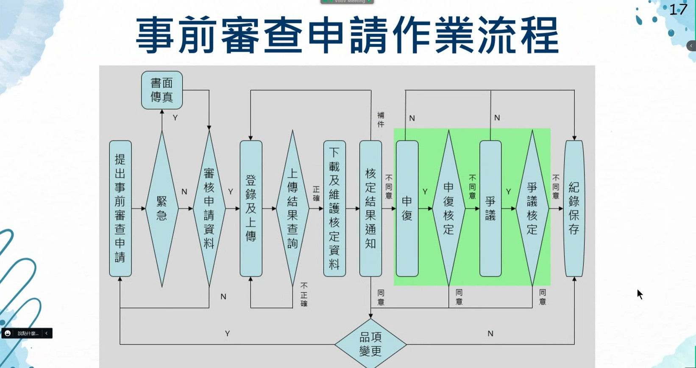

全民健康保險住院診斷關聯群

DRG(Diagnosis Related Groups)

把住院的案件依診斷處置分類，只有住院的可以用DRG，門急診不行

當次住院的所有費用

主要診斷類別 (器官/類別)

MDC (Major Diagnosis category)

合併症/併發症

CC(Comorbidity/Complication)

醫學中心

區域醫院

地區醫院

下限  /  定額  /  上限

如果使用的金額比公告的下限還低，就只能用多少申請多少

如果高於下限並且低於上限，則拿到定額

如果高於上限，則拿到定額 + (費用-==上限還是定額沒記到==)的8折

事前審查

事出緊急的話可以先治療再補件審查，不然都要先經過健保署審查完才可以使用

提出事審申請=>判斷緊急與否=>審核資料=>登陸上傳=>結果查詢=>下載維護核定資料=>核定結果通知=>(如果沒過)申覆=>申覆核定=>(申覆沒過)爭議=>(送爭審會)爭議核定=>記錄保存

護囑關帳=>拿到錢(?)=>批價審核=>出院

