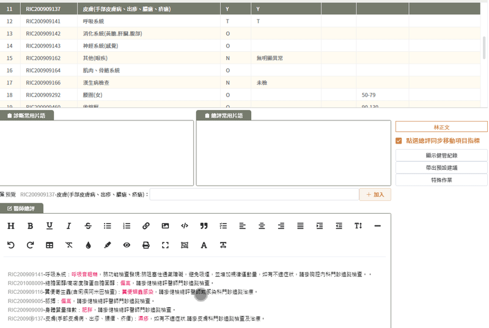

# table滾動條移到選中行位置



```vue
<JNPFTable :data="list" ref="List" @current-change="handleCurrentChange" highlight-current-row></JNPFTable>
```

```js
handleCurrentChange(row){
  this.currentRow = row
}

itemCodeSetCurrentRow(aItemCode){
  // 使用代碼等非滑鼠點擊方式highlight選中資料行
  let currentItemRow = this.list.find(row => row.itemCode === aItemCode)
  this.$refs.List.$refs.JNPFTable.setCurrentRow(currentItemRow)
  this.gotoCurrentRowScrollHeight()
}

gotoCurrentRowScrollHeight(){
  this.$nextTick(()=>{
    // 取得table元素
    let tableEl = this.$refs.List.$refs.JNPFTable.$el
    // 取得選中行距離視窗的高度
    const targetTop = tableEl.querySelectorAll('.el-table__body tr')[this.currentRow.index].getBoundingClientRect().top
    // 取得表格距離視窗的高度
    const containerTop = tableEl.querySelector('.el-table__body').getBoundingClientRect().top
    // 取得表格內長出滾動條的那層元素
    let container = tableEl.querySelector(".el-table__body-wrapper");
    // 計算滾動條高度
    container.scrollTop = targetTop - containerTop;
  })
}
```


